# PeerPush Documentation

Welcome to the comprehensive documentation for PeerPush - a peer-to-peer challenge verification platform with integrated token economy and payment processing.

## � Table of Contents

- [�📚 Documentation Structure](#-documentation-structure)
- [🚀 Quick Start](#-quick-start)
- [🔄 System Flows](#-system-flows)
- [🏗️ Architecture Overview](#️-architecture-overview)
- [📊 Business Model](#-business-model)
- [🛠️ Development](#️-development)
- [🚢 Deployment](#-deployment)
- [📈 Monitoring](#-monitoring)
- [🔍 Troubleshooting](#-troubleshooting)

## 📚 Documentation Structure

### 🏗️ System Documentation
- **[System Overview](system/overview.md)** - Architecture, components, and technical foundation
- **[Token Economy](system/token-economy.md)** - M7 token system, FIFO allocation, and pricing model
- **[Challenge System](system/challenge-system.md)** - Challenge lifecycle, verification mechanics, and payout logic
- **[Wallet System](system/wallet-system.md)** - Advanced wallet features, transaction processing, and ACID compliance
- **[Payment Processing](system/payment-processing.md)** - Stripe integration, financial flows, and error handling
- **[Platform Revenue](system/platform-revenue.md)** - Revenue model, analytics, and forfeited stake management
- **[Security Model](system/security.md)** - Authentication, authorization, encryption, and compliance

### 🔌 API Documentation
- **[Authentication](api/authentication.md)** - JWT authentication, registration, and session management
- **[Wallet Endpoints](api/wallet.md)** - Balance management, deposits, withdrawals, and Stripe integration
- **[Challenge Endpoints](api/challenges.md)** - Challenge CRUD, participation, and lifecycle management
- **[Submission Endpoints](api/submissions.md)** - File uploads, verification system, and proof management
- **[Ledger Endpoints](api/ledger.md)** - Transaction history, analytics, audit trails, and reporting

### 🔄 Workflow Documentation
- **[User Onboarding](workflows/user-onboarding.md)** - Registration, verification, and first-time user experience
- **[Challenge Participation](workflows/challenge-participation.md)** - Complete challenge lifecycle from creation to payout
- **[Payment Flows](workflows/payment-flows.md)** - Comprehensive payment processing workflows
- **[Verification Process](workflows/verification-process.md)** - Peer verification system and consensus mechanisms
- **[Platform Operations](workflows/platform-operations.md)** - Administrative operations and revenue management

### 🛠️ Development Documentation
- **[Setup Guide](development/setup.md)** - Local development environment setup
- **[API Testing](development/api-testing.md)** - Comprehensive API testing strategies and examples
- **[Database Management](development/database.md)** - Schema management, migrations, and optimization
- **[Deployment Guide](development/deployment.md)** - Production deployment and infrastructure setup
- **[Contributing](development/contributing.md)** - Development guidelines and contribution process

### 📊 Business Documentation
- **[Business Model](business/business-model.md)** - Revenue streams, market analysis, and growth strategy
- **[User Guide](business/user-guide.md)** - End-user documentation and feature guides
- **[Admin Guide](business/admin-guide.md)** - Platform administration and management
- **[Analytics Guide](business/analytics.md)** - Business intelligence and performance metrics

## 🚀 Quick Start

### For Developers
1. **Environment Setup**: See [Setup Guide](development/setup.md)
2. **API Authentication**: Review [Authentication](api/authentication.md)
3. **Database Setup**: Follow [Database Management](development/database.md)
4. **Testing**: Use [API Testing Guide](development/api-testing.md)

### For Users
1. **Registration**: Create account via [User Guide](business/user-guide.md#registration)
2. **First Deposit**: Add tokens to your wallet
3. **Join Challenge**: Participate in your first challenge
4. **Verification**: Learn the peer verification process

### For Admins
1. **Platform Setup**: Configure via [Admin Guide](business/admin-guide.md)
2. **Monitoring**: Set up [Analytics](business/analytics.md)
3. **Operations**: Follow [Platform Operations](workflows/platform-operations.md)

## 🔄 System Flows

### Complete User Journey

```mermaid
graph TD
    A[👤 User Registration] --> B[💳 Deposit Tokens via Stripe]
    B --> C[🎯 Create/Join Challenge]
    C --> D[📤 Submit Proof]
    D --> E[✅ Peer Verification]
    E --> F{🏁 Challenge Complete?}
    F -->|Yes| G[💰 Automatic Payout]
    F -->|No| H[⏳ Continue Verification]
    G --> I[💸 Withdraw to Bank]
    H --> E
    
    style A fill:#e1f5fe
    style B fill:#f3e5f5
    style C fill:#e8f5e8
    style G fill:#fff3e0
```


### Challenge Lifecycle


### Token Flow Architecture


## 🏗️ Architecture Overview

### High-Level System Design


### Technology Stack
- **Backend**: Python 3.11+, FastAPI, SQLAlchemy ORM
- **Database**: PostgreSQL 15+ with ACID compliance
- **Cache**: Redis 7+ for session and application caching
- **Payments**: Stripe API for deposits and withdrawals
- **Storage**: AWS S3 or MinIO for file storage
- **Authentication**: JWT with HS256 signing
- **Deployment**: Docker, Docker Compose, Kubernetes ready
- **Monitoring**: Prometheus, Grafana, structured logging

## 📊 Business Model

### Revenue Streams
1. **Challenge Forfeitures** (Primary)
   - Failed challenges = platform captures stakes
   - Typical 15-30% of challenges fail
   - Average forfeiture: $25-100 per failed challenge

2. **Transaction Fees** (Future)
   - 2% fee on deposits above $100
   - Premium features for power users
   - Corporate team challenges

3. **Data Insights** (Future)
   - Aggregated wellness analytics
   - Partner integrations with fitness brands
   - Challenge success pattern analysis

### Key Metrics
- Token pricing: 1 token = 1 USD cent
- JWT access token: 15 minutes
- JWT refresh token: 7 days
- Daily deposit limit: 100,000 tokens ($1,000)
- Refund window: 90 days
- User Lifetime Value: $245 average
- Challenge Success Rate: 70% completion
- Monthly Active Users: Growing 15% MoM
- Average Challenge Value: $50 stake
- Platform Revenue: $700+ monthly from forfeitures

## 🛠️ Development

### Prerequisites
- Python 3.11+
- PostgreSQL 15+
- Redis 7+
- Docker & Docker Compose
- Stripe Account (test keys for development)

### Quick Development Setup
```bash
# Clone and setup
git clone https://github.com/2bTwist/peerpush.git
cd peerpush

# Environment setup
cp .env.example .env.dev
# Edit .env.dev with your values

# Start infrastructure
docker-compose -f infra/compose.dev.yml up -d

# Install dependencies
pip install -r requirements.txt

# Run migrations
alembic upgrade head

# Start development server
uvicorn main:app --reload --port 8000
```

### Development Workflow
1. **Create Feature Branch**: `git checkout -b feature/new-feature`
2. **Write Tests**: Add tests in `tests/` directory
3. **Implement Feature**: Follow existing patterns
4. **Run Tests**: `pytest tests/`
5. **Update Documentation**: Document API changes
6. **Create Pull Request**: Include tests and documentation

### Testing Strategy
- **Unit Tests**: 90%+ coverage for business logic
- **Integration Tests**: API endpoint testing
- **End-to-End Tests**: Complete user workflows
- **Load Tests**: Performance under scale
- **Security Tests**: Authentication and authorization

## 🚢 Deployment

### Production Architecture


### Environment Configuration
- **Development**: Single container setup
- **Staging**: Multi-container with test data
- **Production**: Auto-scaling with monitoring
- **DR Site**: Cross-region backup and failover

### Deployment Steps
1. **Infrastructure**: Provision cloud resources
2. **Database**: Setup primary and replica
3. **Application**: Deploy containerized app
4. **Monitoring**: Configure alerts and dashboards
5. **DNS**: Configure domain and SSL certificates

## 📈 Monitoring

### Key Performance Indicators
- **System Health**: 99.9% uptime target
- **Response Times**: <200ms for API endpoints
- **Database Performance**: <50ms query times
- **Error Rates**: <0.1% error rate
- **User Satisfaction**: >4.5/5 rating

### Monitoring Stack
- **Metrics**: Prometheus + Grafana
- **Logs**: ELK Stack (Elasticsearch, Logstash, Kibana)
- **APM**: Application Performance Monitoring
- **Alerts**: PagerDuty integration
- **Uptime**: StatusPage for public status

### Alert Thresholds
- CPU usage >80% for 5 minutes
- Memory usage >85% for 5 minutes
- Database connections >90% of pool
- API error rate >1% for 5 minutes
- Payment failures >2% for 10 minutes

## 🔍 Troubleshooting

### Common Issues

#### Database Connection Issues
```bash
# Check connection
docker-compose -f infra/compose.dev.yml exec db psql -U postgres -d peerpush_dev

# View logs
docker-compose -f infra/compose.dev.yml logs db

# Reset database
docker-compose -f infra/compose.dev.yml down
docker volume rm peerpush_db_data
docker-compose -f infra/compose.dev.yml up -d
```

#### Stripe Webhook Issues
```bash
# Test webhook endpoint
curl -X POST http://localhost:8000/stripe/webhook \
  -H "Content-Type: application/json" \
  -d '{"type": "test.event"}'

# Check Stripe CLI
stripe listen --forward-to localhost:8000/stripe/webhook
```

#### Authentication Problems
```bash
# Verify JWT configuration
echo $JWT_SECRET | base64 -d
python -c "import jwt; print(jwt.decode('TOKEN', 'SECRET', algorithms=['HS256']))"
```

### Performance Optimization
- **Database**: Add indexes for common queries
- **Caching**: Use Redis for frequently accessed data  
- **API**: Implement pagination and filtering
- **Files**: Use CDN for static content
- **Monitoring**: Profile slow endpoints

### Security Checklist
- [ ] JWT secrets are properly configured
- [ ] Database credentials are encrypted
- [ ] API rate limiting is enabled
- [ ] File uploads are validated
- [ ] HTTPS is enforced in production
- [ ] Sensitive data is encrypted at rest
- [ ] Regular security updates applied

## 📝 Additional Resources

### External Documentation
- [FastAPI Documentation](https://fastapi.tiangolo.com/)
- [SQLAlchemy ORM Guide](https://docs.sqlalchemy.org/)
- [Stripe API Reference](https://stripe.com/docs/api)
- [PostgreSQL Documentation](https://www.postgresql.org/docs/)
- [Redis Documentation](https://redis.io/documentation)

### Support Channels
- **Developer Chat**: Slack #peerpush-dev
- **Issue Tracking**: GitHub Issues
- **Documentation Updates**: Pull requests welcome
- **Security Issues**: security@peerpush.com

---

*Last Updated: September 30, 2025*
*Version: 2.0.0*