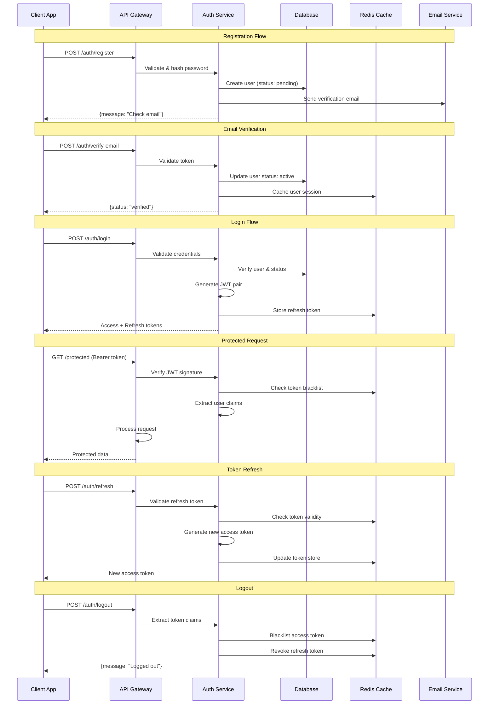

# Authentication API

## Overview

The Chally authentication system uses JWT-based authentication with access and refresh token pairs. This provides secure, stateless authentication while allowing for token refresh without requiring users to re-enter credentials.

## Base URL
```
http://localhost:8000/auth
```

## Authentication Flow



## Security Architecture

### Token Security Model
- **Access Tokens**: Short-lived (15 minutes), stateless JWT
- **Refresh Tokens**: Long-lived (7 days), stored in secure HTTP-only cookies or secure storage
- **Token Rotation**: New refresh token issued on each refresh to prevent replay attacks
- **Blacklisting**: Compromised tokens can be immediately invalidated
- **Rate Limiting**: Authentication endpoints protected against brute force

### Password Security
- **Hashing**: bcrypt with configurable work factor (default: 12 rounds)
- **Complexity**: Minimum 8 characters, recommended 12+ with mixed case, numbers
- **Breach Protection**: Check against known compromised password databases
- **Password Reset**: Secure token-based reset with expiration

### Session Management
- **Concurrent Sessions**: Multiple device support with session tracking
- **Device Registration**: Optional device fingerprinting and recognition
- **Suspicious Activity**: Automatic logout on suspicious login patterns
- **Geographic Tracking**: Optional location-based security alerts

## Endpoints

### Register User
Create a new user account.

**Endpoint:** `POST /auth/register`

**Request Body:**
```json
{
  "email": "user@example.com",
  "username": "johndoe",
  "password": "securepassword123",
  "name": "John Doe",
  "timezone": "America/New_York"
}
```

**Response (201 Created):**
```json
{
  "id": "550e8400-e29b-41d4-a716-446655440000",
  "email": "user@example.com",
  "username": "johndoe",
  "created_at": "2024-01-01T12:00:00Z"
}
```

**Error Responses:**
- **400 Bad Request:** Invalid input data
- **409 Conflict:** Email or username already exists

### Login
Authenticate user and receive JWT tokens.

**Endpoint:** `POST /auth/login`

**Request Body:**
```json
{
  "email": "user@example.com",
  "password": "securepassword123"
}
```

**Response (200 OK):**
```json
{
  "access": "eyJhbGciOiJIUzI1NiIsInR5cCI6IkpXVCJ9...",
  "refresh": "eyJhbGciOiJIUzI1NiIsInR5cCI6IkpXVCJ9..."
}
```

**Token Details:**
- **Access Token:** Expires in 15 minutes, used for API authentication
- **Refresh Token:** Expires in 7 days, used to obtain new access tokens

**Error Responses:**
- **400 Bad Request:** Missing email or password
- **401 Unauthorized:** Invalid credentials
- **429 Too Many Requests:** Rate limit exceeded (5 attempts per minute)

### Get Current User
Retrieve authenticated user's profile information.

**Endpoint:** `GET /auth/me`

**Headers:**
```
Authorization: Bearer <access_token>
```

**Response (200 OK):**
```json
{
  "id": "550e8400-e29b-41d4-a716-446655440000",
  "email": "user@example.com",
  "username": "johndoe",
  "created_at": "2024-01-01T12:00:00Z"
}
```

**Error Responses:**
- **401 Unauthorized:** Missing or invalid access token
- **403 Forbidden:** Token expired

### Refresh Token
Obtain a new access token using refresh token.

**Endpoint:** `POST /auth/refresh`

**Headers:**
```
Authorization: Bearer <refresh_token>
```

**Response (200 OK):**
```json
{
  "access": "eyJhbGciOiJIUzI1NiIsInR5cCI6IkpXVCJ9...",
  "refresh": "eyJhbGciOiJIUzI1NiIsInR5cCI6IkpXVCJ9..."
}
```

**Error Responses:**
- **401 Unauthorized:** Missing or invalid refresh token
- **403 Forbidden:** Refresh token expired

## Authentication Usage

### Including Access Token
All protected endpoints require the access token in the Authorization header:

```bash
curl -H "Authorization: Bearer <access_token>" \
     http://localhost:8000/wallet
```

### Token Refresh Strategy
Implement automatic token refresh in your client application:

```javascript
// Example JavaScript implementation
class AuthService {
  async makeAuthenticatedRequest(url, options = {}) {
    let token = localStorage.getItem('access_token');
    
    // Add token to request
    options.headers = {
      ...options.headers,
      'Authorization': `Bearer ${token}`
    };
    
    let response = await fetch(url, options);
    
    // If token expired, refresh and retry
    if (response.status === 401) {
      const refreshed = await this.refreshToken();
      if (refreshed) {
        options.headers['Authorization'] = `Bearer ${localStorage.getItem('access_token')}`;
        response = await fetch(url, options);
      }
    }
    
    return response;
  }
  
  async refreshToken() {
    const refreshToken = localStorage.getItem('refresh_token');
    if (!refreshToken) return false;
    
    try {
      const response = await fetch('/auth/refresh', {
        method: 'POST',
        headers: {
          'Authorization': `Bearer ${refreshToken}`
        }
      });
      
      if (response.ok) {
        const tokens = await response.json();
        localStorage.setItem('access_token', tokens.access);
        localStorage.setItem('refresh_token', tokens.refresh);
        return true;
      }
    } catch (error) {
      console.error('Token refresh failed:', error);
    }
    
    // Refresh failed, redirect to login
    this.logout();
    return false;
  }
  
  logout() {
    localStorage.removeItem('access_token');
    localStorage.removeItem('refresh_token');
    window.location.href = '/login';
  }
}
```

## Security Considerations

### Password Requirements
- Minimum 8 characters
- Must contain uppercase and lowercase letters
- Must contain at least one number
- Maximum 128 characters

### Rate Limiting
- **Login:** 5 attempts per minute per IP address
- **Registration:** 2 attempts per minute per IP address
- **Refresh:** 10 attempts per minute per user

### Token Security
- **Access tokens** are short-lived (15 minutes) to minimize exposure
- **Refresh tokens** are longer-lived (7 days) but can be revoked
- All tokens use HS256 signing algorithm
- JWT secrets should be at least 256 bits in production

### Best Practices
1. **Store tokens securely:** Use httpOnly cookies or secure storage
2. **Implement token refresh:** Don't let users experience authentication failures
3. **Handle errors gracefully:** Provide clear feedback for authentication issues
4. **Use HTTPS:** Never send tokens over unencrypted connections
5. **Validate on server:** Always verify tokens server-side

## Error Handling

### Common Error Responses

#### 400 Bad Request
```json
{
  "detail": [
    {
      "loc": ["body", "email"],
      "msg": "field required",
      "type": "missing"
    }
  ]
}
```

#### 401 Unauthorized
```json
{
  "detail": "Invalid credentials"
}
```

#### 409 Conflict
```json
{
  "detail": "Email already registered"
}
```

#### 429 Too Many Requests
```json
{
  "detail": "Too many login attempts. Try again later."
}
```

### Client Error Handling Example
```javascript
class AuthClient {
  constructor(baseURL, options = {}) {
    this.baseURL = baseURL;
    this.options = {
      timeout: 30000,
      retryAttempts: 3,
      retryDelay: 1000,
      ...options
    };
    this.accessToken = localStorage.getItem('access_token');
    this.refreshToken = localStorage.getItem('refresh_token');
  }

  async makeAuthRequest(endpoint, options = {}) {
    const url = `${this.baseURL}${endpoint}`;
    const config = {
      headers: {
        'Content-Type': 'application/json',
        ...options.headers
      },
      ...options
    };

    // Add Authorization header if token exists
    if (this.accessToken && !options.skipAuth) {
      config.headers.Authorization = `Bearer ${this.accessToken}`;
    }

    let attempt = 0;
    while (attempt < this.options.retryAttempts) {
      try {
        const response = await fetch(url, config);
        
        if (response.status === 401 && !options.skipAuth) {
          // Token expired, try refresh
          const refreshed = await this.refreshAccessToken();
          if (refreshed) {
            // Retry with new token
            config.headers.Authorization = `Bearer ${this.accessToken}`;
            const retryResponse = await fetch(url, config);
            return await this.handleResponse(retryResponse);
          } else {
            // Refresh failed, redirect to login
            this.handleAuthFailure();
            throw new Error('Authentication failed');
          }
        }
        
        return await this.handleResponse(response);
        
      } catch (error) {
        attempt++;
        if (attempt >= this.options.retryAttempts) {
          throw error;
        }
        
        // Exponential backoff
        await new Promise(resolve => 
          setTimeout(resolve, this.options.retryDelay * Math.pow(2, attempt))
        );
      }
    }
  }

  async handleResponse(response) {
    const contentType = response.headers.get('content-type');
    const isJSON = contentType && contentType.includes('application/json');
    
    if (!response.ok) {
      const errorData = isJSON ? await response.json() : { message: response.statusText };
      
      switch (response.status) {
        case 400:
          throw new ValidationError(errorData.detail, errorData.errors);
        case 401:
          throw new AuthenticationError(errorData.detail);
        case 403:
          throw new AuthorizationError(errorData.detail);
        case 409:
          throw new ConflictError(errorData.detail);
        case 429:
          throw new RateLimitError(errorData.detail, response.headers.get('Retry-After'));
        case 500:
          throw new ServerError('Internal server error');
        default:
          throw new APIError(errorData.detail || 'Unknown error', response.status);
      }
    }
    
    return isJSON ? await response.json() : response;
  }

  async register(userData) {
    try {
      const response = await this.makeAuthRequest('/auth/register', {
        method: 'POST',
        body: JSON.stringify(userData),
        skipAuth: true
      });
      
      return {
        success: true,
        data: response,
        message: 'Registration successful. Please check your email for verification.'
      };
      
    } catch (error) {
      return this.handleAuthError(error, 'Registration failed');
    }
  }

  async login(credentials) {
    try {
      const response = await this.makeAuthRequest('/auth/login', {
        method: 'POST',
        body: JSON.stringify(credentials),
        skipAuth: true
      });
      
      // Store tokens securely
      this.setTokens(response.access_token, response.refresh_token);
      
      return {
        success: true,
        data: response,
        message: 'Login successful'
      };
      
    } catch (error) {
      return this.handleAuthError(error, 'Login failed');
    }
  }

  async refreshAccessToken() {
    if (!this.refreshToken) {
      return false;
    }
    
    try {
      const response = await fetch(`${this.baseURL}/auth/refresh`, {
        method: 'POST',
        headers: {
          'Content-Type': 'application/json',
          'Authorization': `Bearer ${this.refreshToken}`
        }
      });
      
      if (response.ok) {
        const data = await response.json();
        this.accessToken = data.access_token;
        localStorage.setItem('access_token', this.accessToken);
        return true;
      }
      
      return false;
      
    } catch (error) {
      console.error('Token refresh failed:', error);
      return false;
    }
  }

  setTokens(accessToken, refreshToken) {
    this.accessToken = accessToken;
    this.refreshToken = refreshToken;
    
    // Store in localStorage (consider more secure storage for production)
    localStorage.setItem('access_token', accessToken);
    localStorage.setItem('refresh_token', refreshToken);
    
    // Set up automatic refresh before expiration
    this.scheduleTokenRefresh();
  }

  scheduleTokenRefresh() {
    if (!this.accessToken) return;
    
    try {
      // Decode JWT to get expiration time
      const payload = JSON.parse(atob(this.accessToken.split('.')[1]));
      const expirationTime = payload.exp * 1000; // Convert to milliseconds
      const currentTime = Date.now();
      const refreshTime = expirationTime - currentTime - 60000; // Refresh 1 minute before expiration
      
      if (refreshTime > 0) {
        setTimeout(() => {
          this.refreshAccessToken();
        }, refreshTime);
      }
    } catch (error) {
      console.error('Error scheduling token refresh:', error);
    }
  }

  async logout() {
    try {
      await this.makeAuthRequest('/auth/logout', {
        method: 'POST'
      });
    } catch (error) {
      console.error('Logout request failed:', error);
    } finally {
      // Clear tokens regardless of request success
      this.clearTokens();
    }
  }

  clearTokens() {
    this.accessToken = null;
    this.refreshToken = null;
    localStorage.removeItem('access_token');
    localStorage.removeItem('refresh_token');
  }

  handleAuthFailure() {
    this.clearTokens();
    // Redirect to login page or emit event
    window.location.href = '/login';
  }

  handleAuthError(error, defaultMessage) {
    let message = defaultMessage;
    let errors = null;
    
    if (error instanceof ValidationError) {
      message = 'Please check your input and try again.';
      errors = error.errors;
    } else if (error instanceof AuthenticationError) {
      message = 'Invalid credentials. Please try again.';
    } else if (error instanceof ConflictError) {
      message = 'An account with this email already exists.';
    } else if (error instanceof RateLimitError) {
      message = `Too many attempts. Please wait ${error.retryAfter || 60} seconds.`;
    } else if (error instanceof ServerError) {
      message = 'Server error. Please try again later.';
    }
    
    return {
      success: false,
      error: error.message,
      message,
      errors
    };
  }

  isAuthenticated() {
    return !!this.accessToken;
  }

  getUser() {
    if (!this.accessToken) return null;
    
    try {
      const payload = JSON.parse(atob(this.accessToken.split('.')[1]));
      return {
        id: payload.sub,
        email: payload.email,
        username: payload.username,
        exp: payload.exp
      };
    } catch (error) {
      return null;
    }
  }
}

// Custom Error Classes
class APIError extends Error {
  constructor(message, status) {
    super(message);
    this.name = 'APIError';
    this.status = status;
  }
}

class ValidationError extends APIError {
  constructor(message, errors) {
    super(message);
    this.name = 'ValidationError';
    this.errors = errors;
  }
}

class AuthenticationError extends APIError {
  constructor(message) {
    super(message);
    this.name = 'AuthenticationError';
    this.status = 401;
  }
}

class AuthorizationError extends APIError {
  constructor(message) {
    super(message);
    this.name = 'AuthorizationError';
    this.status = 403;
  }
}

class ConflictError extends APIError {
  constructor(message) {
    super(message);
    this.name = 'ConflictError';
    this.status = 409;
  }
}

class RateLimitError extends APIError {
  constructor(message, retryAfter) {
    super(message);
    this.name = 'RateLimitError';
    this.status = 429;
    this.retryAfter = retryAfter;
  }
}

class ServerError extends APIError {
  constructor(message) {
    super(message);
    this.name = 'ServerError';
    this.status = 500;
  }
}

// Usage Example
const authClient = new AuthClient('http://localhost:8000');

// Register user
const registrationResult = await authClient.register({
  email: 'user@example.com',
  password: 'securePassword123',
  username: 'newuser'
});

if (registrationResult.success) {
  console.log(registrationResult.message);
} else {
  console.error('Registration failed:', registrationResult.message);
  if (registrationResult.errors) {
    console.log('Validation errors:', registrationResult.errors);
  }
}

// Login user
const loginResult = await authClient.login({
  email: 'user@example.com',
  password: 'securePassword123'
});

if (loginResult.success) {
  console.log('User logged in successfully');
  console.log('User info:', authClient.getUser());
} else {
  console.error('Login failed:', loginResult.message);
}
```

## Integration Patterns

### React Hook Integration
```jsx
import { useState, useEffect, createContext, useContext } from 'react';

const AuthContext = createContext();

export const useAuth = () => {
  const context = useContext(AuthContext);
  if (!context) {
    throw new Error('useAuth must be used within an AuthProvider');
  }
  return context;
};

export const AuthProvider = ({ children }) => {
  const [user, setUser] = useState(null);
  const [loading, setLoading] = useState(true);
  const [authClient] = useState(() => new AuthClient('http://localhost:8000'));

  useEffect(() => {
    // Check for existing token on mount
    const initAuth = async () => {
      if (authClient.isAuthenticated()) {
        try {
          const userInfo = await authClient.makeAuthRequest('/auth/me');
          setUser(userInfo);
        } catch (error) {
          console.error('Failed to get user info:', error);
          authClient.clearTokens();
        }
      }
      setLoading(false);
    };

    initAuth();
  }, [authClient]);

  const login = async (credentials) => {
    setLoading(true);
    try {
      const result = await authClient.login(credentials);
      if (result.success) {
        const userInfo = await authClient.makeAuthRequest('/auth/me');
        setUser(userInfo);
        return { success: true };
      }
      return result;
    } catch (error) {
      return { success: false, message: error.message };
    } finally {
      setLoading(false);
    }
  };

  const logout = async () => {
    await authClient.logout();
    setUser(null);
  };

  const register = async (userData) => {
    setLoading(true);
    try {
      return await authClient.register(userData);
    } finally {
      setLoading(false);
    }
  };

  const value = {
    user,
    loading,
    login,
    logout,
    register,
    isAuthenticated: !!user,
    authClient
  };

  return (
    <AuthContext.Provider value={value}>
      {children}
    </AuthContext.Provider>
  );
};

// Protected Route Component
export const ProtectedRoute = ({ children }) => {
  const { user, loading } = useAuth();

  if (loading) {
    return <div>Loading...</div>;
  }

  if (!user) {
    return <Navigate to="/login" replace />;
  }

  return children;
};

// Usage in components
const LoginComponent = () => {
  const { login, loading } = useAuth();
  const [formData, setFormData] = useState({ email: '', password: '' });
  const [error, setError] = useState('');

  const handleSubmit = async (e) => {
    e.preventDefault();
    setError('');
    
    const result = await login(formData);
    if (!result.success) {
      setError(result.message);
    }
  };

  return (
    <form onSubmit={handleSubmit}>
      <input
        type="email"
        value={formData.email}
        onChange={(e) => setFormData({ ...formData, email: e.target.value })}
        placeholder="Email"
        required
      />
      <input
        type="password"
        value={formData.password}
        onChange={(e) => setFormData({ ...formData, password: e.target.value })}
        placeholder="Password"
        required
      />
      <button type="submit" disabled={loading}>
        {loading ? 'Logging in...' : 'Login'}
      </button>
      {error && <div className="error">{error}</div>}
    </form>
  );
};
```

### Vue.js Composition API Integration
```js
// composables/useAuth.js
import { ref, computed, reactive } from 'vue';
import { AuthClient } from './authClient';

const authClient = new AuthClient('http://localhost:8000');
const user = ref(null);
const loading = ref(false);
const error = ref('');

export const useAuth = () => {
  const isAuthenticated = computed(() => !!user.value);

  const login = async (credentials) => {
    loading.value = true;
    error.value = '';
    
    try {
      const result = await authClient.login(credentials);
      if (result.success) {
        const userInfo = await authClient.makeAuthRequest('/auth/me');
        user.value = userInfo;
        return { success: true };
      } else {
        error.value = result.message;
        return result;
      }
    } catch (err) {
      error.value = err.message;
      return { success: false, message: err.message };
    } finally {
      loading.value = false;
    }
  };

  const logout = async () => {
    await authClient.logout();
    user.value = null;
    error.value = '';
  };

  const register = async (userData) => {
    loading.value = true;
    error.value = '';
    
    try {
      const result = await authClient.register(userData);
      if (!result.success) {
        error.value = result.message;
      }
      return result;
    } finally {
      loading.value = false;
    }
  };

  const clearError = () => {
    error.value = '';
  };

  // Initialize auth state
  const initAuth = async () => {
    if (authClient.isAuthenticated()) {
      try {
        const userInfo = await authClient.makeAuthRequest('/auth/me');
        user.value = userInfo;
      } catch (err) {
        console.error('Failed to initialize auth:', err);
        authClient.clearTokens();
      }
    }
  };

  return {
    user: readonly(user),
    loading: readonly(loading),
    error: readonly(error),
    isAuthenticated,
    login,
    logout,
    register,
    clearError,
    initAuth,
    authClient
  };
};
```

### Mobile App Integration (React Native)
```javascript
import AsyncStorage from '@react-native-async-storage/async-storage';
import { Alert } from 'react-native';

class MobileAuthClient extends AuthClient {
  constructor() {
    super('https://api.chally.com', {
      timeout: 30000,
      retryAttempts: 3
    });
    this.initializeTokens();
  }

  async initializeTokens() {
    try {
      const [accessToken, refreshToken] = await Promise.all([
        AsyncStorage.getItem('access_token'),
        AsyncStorage.getItem('refresh_token')
      ]);
      
      this.accessToken = accessToken;
      this.refreshToken = refreshToken;
      
      if (this.accessToken) {
        this.scheduleTokenRefresh();
      }
    } catch (error) {
      console.error('Failed to initialize tokens:', error);
    }
  }

  async setTokens(accessToken, refreshToken) {
    this.accessToken = accessToken;
    this.refreshToken = refreshToken;
    
    try {
      await Promise.all([
        AsyncStorage.setItem('access_token', accessToken),
        AsyncStorage.setItem('refresh_token', refreshToken)
      ]);
      
      this.scheduleTokenRefresh();
    } catch (error) {
      console.error('Failed to store tokens:', error);
      Alert.alert('Storage Error', 'Failed to save authentication tokens');
    }
  }

  async clearTokens() {
    this.accessToken = null;
    this.refreshToken = null;
    
    try {
      await Promise.all([
        AsyncStorage.removeItem('access_token'),
        AsyncStorage.removeItem('refresh_token')
      ]);
    } catch (error) {
      console.error('Failed to clear tokens:', error);
    }
  }

  handleAuthFailure() {
    this.clearTokens();
    // Navigate to login screen
    // This depends on your navigation library (React Navigation, etc.)
    // navigationRef.current?.navigate('Login');
  }

  async biometricLogin() {
    // Integrate with react-native-biometrics or similar
    try {
      const biometricResult = await BiometricAuth.authenticate({
        promptMessage: 'Authenticate to access Chally',
        fallbackPromptMessage: 'Use PIN/Password'
      });
      
      if (biometricResult.success) {
        // Retrieve stored credentials or refresh token
        const refreshToken = await AsyncStorage.getItem('refresh_token');
        if (refreshToken) {
          return await this.refreshAccessToken();
        }
      }
      
      return false;
    } catch (error) {
      console.error('Biometric authentication failed:', error);
      return false;
    }
  }
}

// React Native Hook
import { useState, useEffect, useCallback } from 'react';
import NetInfo from '@react-native-netinfo/netinfo';

export const useMobileAuth = () => {
  const [authClient] = useState(() => new MobileAuthClient());
  const [user, setUser] = useState(null);
  const [loading, setLoading] = useState(true);
  const [isOnline, setIsOnline] = useState(true);

  useEffect(() => {
    // Network state monitoring
    const unsubscribe = NetInfo.addEventListener(state => {
      setIsOnline(state.isConnected);
    });

    return unsubscribe;
  }, []);

  const initAuth = useCallback(async () => {
    setLoading(true);
    
    try {
      if (authClient.isAuthenticated() && isOnline) {
        const userInfo = await authClient.makeAuthRequest('/auth/me');
        setUser(userInfo);
      }
    } catch (error) {
      console.error('Auth initialization failed:', error);
      if (error.status === 401) {
        authClient.clearTokens();
      }
    } finally {
      setLoading(false);
    }
  }, [authClient, isOnline]);

  useEffect(() => {
    initAuth();
  }, [initAuth]);

  const login = async (credentials, useBiometric = false) => {
    if (!isOnline) {
      return {
        success: false,
        message: 'No internet connection. Please check your network.'
      };
    }

    setLoading(true);
    
    try {
      let result;
      
      if (useBiometric) {
        result = await authClient.biometricLogin();
        if (result) {
          const userInfo = await authClient.makeAuthRequest('/auth/me');
          setUser(userInfo);
          return { success: true };
        } else {
          return { success: false, message: 'Biometric authentication failed' };
        }
      } else {
        result = await authClient.login(credentials);
        if (result.success) {
          const userInfo = await authClient.makeAuthRequest('/auth/me');
          setUser(userInfo);
        }
        return result;
      }
    } catch (error) {
      return {
        success: false,
        message: 'Login failed. Please try again.'
      };
    } finally {
      setLoading(false);
    }
  };

  return {
    user,
    loading,
    isOnline,
    login,
    logout: async () => {
      await authClient.logout();
      setUser(null);
    },
    authClient,
    isAuthenticated: !!user
  };
};
```

## Testing Examples

### Unit Tests (Jest)
```javascript
// __tests__/auth.test.js
import { AuthClient } from '../authClient';

// Mock fetch
global.fetch = jest.fn();

describe('AuthClient', () => {
  let authClient;

  beforeEach(() => {
    authClient = new AuthClient('http://localhost:8000');
    fetch.mockClear();
    localStorage.clear();
  });

  describe('login', () => {
    it('should login successfully with valid credentials', async () => {
      const mockResponse = {
        access_token: 'valid-access-token',
        refresh_token: 'valid-refresh-token',
        user: { id: '123', email: 'test@example.com' }
      };

      fetch.mockResolvedValueOnce({
        ok: true,
        json: async () => mockResponse,
        headers: new Map([['content-type', 'application/json']])
      });

      const result = await authClient.login({
        email: 'test@example.com',
        password: 'password123'
      });

      expect(result.success).toBe(true);
      expect(result.data).toEqual(mockResponse);
      expect(localStorage.getItem('access_token')).toBe('valid-access-token');
      expect(localStorage.getItem('refresh_token')).toBe('valid-refresh-token');
    });

    it('should handle invalid credentials', async () => {
      fetch.mockResolvedValueOnce({
        ok: false,
        status: 401,
        json: async () => ({ detail: 'Invalid credentials' }),
        headers: new Map([['content-type', 'application/json']])
      });

      const result = await authClient.login({
        email: 'test@example.com',
        password: 'wrongpassword'
      });

      expect(result.success).toBe(false);
      expect(result.message).toBe('Invalid credentials. Please try again.');
      expect(localStorage.getItem('access_token')).toBeNull();
    });

    it('should handle rate limiting', async () => {
      fetch.mockResolvedValueOnce({
        ok: false,
        status: 429,
        json: async () => ({ detail: 'Too many requests' }),
        headers: new Map([
          ['content-type', 'application/json'],
          ['retry-after', '60']
        ])
      });

      const result = await authClient.login({
        email: 'test@example.com',
        password: 'password123'
      });

      expect(result.success).toBe(false);
      expect(result.message).toContain('60 seconds');
    });
  });

  describe('token refresh', () => {
    it('should refresh token automatically on 401', async () => {
      // Set up initial tokens
      authClient.setTokens('expired-token', 'valid-refresh-token');

      // Mock 401 response for initial request
      fetch.mockResolvedValueOnce({
        ok: false,
        status: 401,
        json: async () => ({ detail: 'Token expired' })
      });

      // Mock successful refresh response
      fetch.mockResolvedValueOnce({
        ok: true,
        json: async () => ({ access_token: 'new-access-token' })
      });

      // Mock successful retry with new token
      fetch.mockResolvedValueOnce({
        ok: true,
        json: async () => ({ data: 'protected-data' })
      });

      const result = await authClient.makeAuthRequest('/protected');

      expect(result.data).toBe('protected-data');
      expect(fetch).toHaveBeenCalledTimes(3);
      expect(localStorage.getItem('access_token')).toBe('new-access-token');
    });
  });

  describe('registration', () => {
    it('should validate email format', async () => {
      fetch.mockResolvedValueOnce({
        ok: false,
        status: 400,
        json: async () => ({
          detail: 'Validation error',
          errors: [{ field: 'email', message: 'Invalid email format' }]
        })
      });

      const result = await authClient.register({
        email: 'invalid-email',
        password: 'password123'
      });

      expect(result.success).toBe(false);
      expect(result.errors).toBeDefined();
      expect(result.errors[0].field).toBe('email');
    });
  });
});
```

### Integration Tests (Cypress/Playwright)
```javascript
// cypress/integration/auth.spec.js
describe('Authentication Flow', () => {
  beforeEach(() => {
    // Reset database and clear storage
    cy.task('db:reset');
    cy.clearLocalStorage();
    cy.visit('/');
  });

  it('should complete full registration and login flow', () => {
    // Registration
    cy.get('[data-testid=register-link]').click();
    cy.get('[data-testid=email-input]').type('newuser@example.com');
    cy.get('[data-testid=password-input]').type('SecurePassword123!');
    cy.get('[data-testid=confirm-password-input]').type('SecurePassword123!');
    cy.get('[data-testid=register-button]').click();

    // Check registration success message
    cy.contains('Registration successful').should('be.visible');
    cy.contains('check your email').should('be.visible');

    // Simulate email verification (in real tests, you'd check email)
    cy.task('db:verifyUser', 'newuser@example.com');

    // Login
    cy.get('[data-testid=login-link]').click();
    cy.get('[data-testid=email-input]').type('newuser@example.com');
    cy.get('[data-testid=password-input]').type('SecurePassword123!');
    cy.get('[data-testid=login-button]').click();

    // Verify successful login
    cy.url().should('not.include', '/login');
    cy.get('[data-testid=user-menu]').should('be.visible');
    cy.get('[data-testid=user-menu]').should('contain', 'newuser@example.com');

    // Verify token storage
    cy.window().then((window) => {
      expect(window.localStorage.getItem('access_token')).to.exist;
      expect(window.localStorage.getItem('refresh_token')).to.exist;
    });
  });

  it('should handle invalid login credentials', () => {
    cy.visit('/login');
    cy.get('[data-testid=email-input]').type('nonexistent@example.com');
    cy.get('[data-testid=password-input]').type('wrongpassword');
    cy.get('[data-testid=login-button]').click();

    cy.get('[data-testid=error-message]').should('be.visible');
    cy.get('[data-testid=error-message]').should('contain', 'Invalid credentials');
    cy.url().should('include', '/login');
  });

  it('should redirect unauthenticated users to login', () => {
    cy.visit('/dashboard');
    cy.url().should('include', '/login');
  });

  it('should handle token expiration gracefully', () => {
    // Login first
    cy.login('testuser@example.com', 'password123');
    cy.visit('/dashboard');

    // Simulate token expiration
    cy.window().then((window) => {
      window.localStorage.setItem('access_token', 'expired-token');
    });

    // Make a request that would trigger token refresh
    cy.get('[data-testid=refresh-button]').click();

    // Should either refresh successfully or redirect to login
    cy.url().should('not.include', '/dashboard').or('eq', Cypress.config().baseUrl + '/dashboard');
  });

  it('should logout successfully', () => {
    cy.login('testuser@example.com', 'password123');
    cy.visit('/dashboard');

    cy.get('[data-testid=user-menu]').click();
    cy.get('[data-testid=logout-button]').click();

    // Verify logout
    cy.url().should('include', '/login');
    cy.window().then((window) => {
      expect(window.localStorage.getItem('access_token')).to.not.exist;
      expect(window.localStorage.getItem('refresh_token')).to.not.exist;
    });
  });
});

// Custom Cypress commands (cypress/support/commands.js)
Cypress.Commands.add('login', (email, password) => {
  cy.request({
    method: 'POST',
    url: `${Cypress.env('API_URL')}/auth/login`,
    body: { email, password }
  }).then((response) => {
    window.localStorage.setItem('access_token', response.body.access_token);
    window.localStorage.setItem('refresh_token', response.body.refresh_token);
  });
});
```

### Load Testing (Artillery)
```yaml
# artillery-auth-test.yml
config:
  target: 'http://localhost:8000'
  phases:
    - duration: 60
      arrivalRate: 10
      name: "Warm up"
    - duration: 120
      arrivalRate: 50
      name: "Load test"
    - duration: 60
      arrivalRate: 100
      name: "Stress test"
  payload:
    path: "users.csv"
    fields:
      - "email"
      - "password"

scenarios:
  - name: "Authentication flow"
    weight: 70
    flow:
      - post:
          url: "/auth/login"
          json:
            email: "{{ email }}"
            password: "{{ password }}"
          capture:
            - json: "$.access_token"
              as: "accessToken"
      - get:
          url: "/auth/me"
          headers:
            Authorization: "Bearer {{ accessToken }}"
      - post:
          url: "/auth/logout"
          headers:
            Authorization: "Bearer {{ accessToken }}"

  - name: "Registration flow"
    weight: 20
    flow:
      - post:
          url: "/auth/register"
          json:
            email: "loadtest-{{ $randomString() }}@example.com"
            password: "TestPassword123!"
            username: "testuser{{ $randomString() }}"

  - name: "Token refresh flow"
    weight: 10
    flow:
      - post:
          url: "/auth/login"
          json:
            email: "{{ email }}"
            password: "{{ password }}"
          capture:
            - json: "$.refresh_token"
              as: "refreshToken"
      - post:
          url: "/auth/refresh"
          headers:
            Authorization: "Bearer {{ refreshToken }}"
```

## Security Best Practices

### Token Security Implementation
- **HTTP-Only Cookies**: For web applications, store refresh tokens in HTTP-only cookies
- **Secure Storage**: Use KeyChain (iOS) or Keystore (Android) for mobile token storage
- **Token Rotation**: Implement refresh token rotation to limit exposure window
- **Blacklisting**: Maintain blacklist of compromised tokens in Redis
- **Rate Limiting**: Implement progressive delays for failed authentication attempts

### OWASP Compliance Checklist
- [ ] Password strength validation
- [ ] Account lockout after failed attempts
- [ ] Secure password reset flow
- [ ] JWT signature verification
- [ ] Input validation and sanitization
- [ ] HTTPS enforcement in production
- [ ] CORS configuration
- [ ] SQL injection prevention
- [ ] XSS protection headers
- [ ] CSRF token implementation

---

*This comprehensive authentication API documentation provides everything needed for secure, scalable user authentication in the Chally platform, from basic implementation to advanced security patterns and testing strategies.*
      showValidationErrors(errors.detail);
    } else if (error.status === 401) {
      // Redirect to login
      redirectToLogin();
    } else if (error.status === 429) {
      // Show rate limit message
      showRateLimitMessage();
    } else {
      // Show generic error
      showGenericError();
    }
  }
}
```

## Testing

### Example Test Cases

```bash
# Register new user
curl -X POST http://localhost:8000/auth/register \
  -H "Content-Type: application/json" \
  -d '{
    "email": "test@example.com",
    "username": "testuser",
    "password": "password123",
    "name": "Test User",
    "timezone": "America/New_York"
  }'

# Login
curl -X POST http://localhost:8000/auth/login \
  -H "Content-Type: application/json" \
  -d '{
    "email": "test@example.com",
    "password": "password123"
  }'

# Get user profile (replace TOKEN with actual access token)
curl -H "Authorization: Bearer TOKEN" \
     http://localhost:8000/auth/me

# Refresh token (replace TOKEN with actual refresh token)
curl -X POST http://localhost:8000/auth/refresh \
  -H "Authorization: Bearer TOKEN"
```