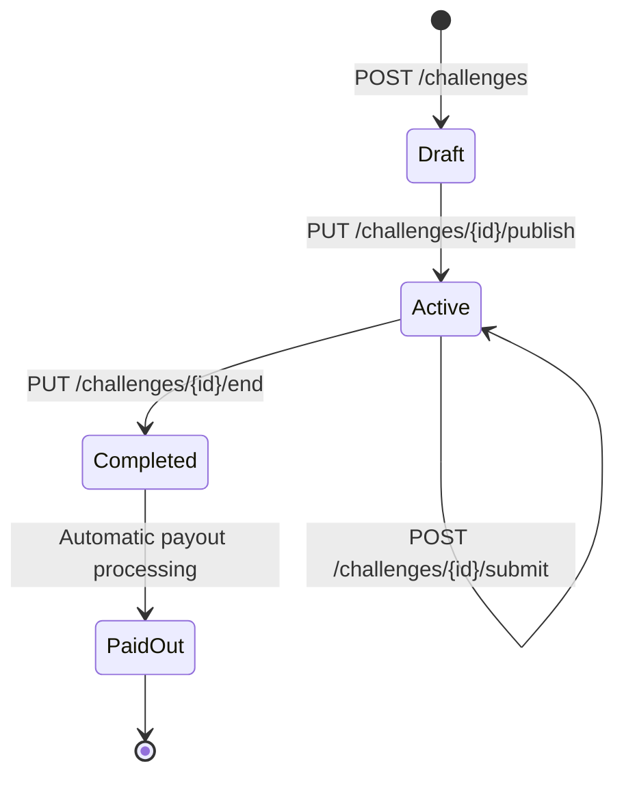

# Challenge API

## Overview

The Challenge API manages the complete challenge lifecycle from creation to payout. It handles challenge participation, stake payments, submission processing, and automatic winner payouts.

## Base URL
```
http://localhost:8000/challenges
```

## Authentication
All challenge endpoints require authentication with a valid access token:
```
Authorization: Bearer <access_token>
```

## Challenge Lifecycle



## Endpoints

### List Challenges

**Endpoint:** `GET /challenges`

**Description:** Get paginated list of challenges with optional filtering.

**Query Parameters:**
- **status** (string, optional): Filter by status (`draft`, `active`, `completed`, `paid_out`)
- **creator_id** (string, optional): Filter by creator UUID
- **limit** (integer, optional): Number of results per page (default: 20, max: 100)
- **offset** (integer, optional): Number of results to skip (default: 0)

**Response (200 OK):**
```json
{
  "challenges": [
    {
      "id": "550e8400-e29b-41d4-a716-446655440000",
      "creator_id": "550e8400-e29b-41d4-a716-446655440001",
      "title": "30-Day Push-up Challenge",
      "description": "Complete 100 push-ups daily for 30 days",
      "rules": "Submit video proof of daily push-ups. Must show proper form.",
      "stake_amount": 50,
      "max_participants": 20,
      "current_participants": 5,
      "start_date": "2024-01-01T00:00:00Z",
      "end_date": "2024-01-31T23:59:59Z",
      "status": "active",
      "verification_threshold": 2,
      "created_at": "2023-12-25T12:00:00Z",
      "updated_at": "2023-12-25T12:00:00Z"
    }
  ],
  "total": 42,
  "limit": 20,
  "offset": 0
}
```

### Get Challenge Details

**Endpoint:** `GET /challenges/{challenge_id}`

**Description:** Get detailed information about a specific challenge.

**Response (200 OK):**
```json
{
  "id": "550e8400-e29b-41d4-a716-446655440000",
  "creator_id": "550e8400-e29b-41d4-a716-446655440001",
  "title": "30-Day Push-up Challenge",
  "description": "Complete 100 push-ups daily for 30 days",
  "rules": "Submit video proof of daily push-ups. Must show proper form.",
  "stake_amount": 50,
  "max_participants": 20,
  "current_participants": 5,
  "start_date": "2024-01-01T00:00:00Z",
  "end_date": "2024-01-31T23:59:59Z",
  "status": "active",
  "verification_threshold": 2,
  "created_at": "2023-12-25T12:00:00Z",
  "updated_at": "2023-12-25T12:00:00Z",
  "participants": [
    {
      "id": "participant-uuid-1",
      "user_id": "user-uuid-1",
      "username": "alice",
      "status": "active",
      "joined_at": "2023-12-26T10:00:00Z",
      "completed_at": null
    }
  ],
  "total_stake_pool": 250
}
```

### Create Challenge

**Endpoint:** `POST /challenges`

**Description:** Create a new challenge in draft status.

**Request Body:**
```json
{
  "title": "30-Day Push-up Challenge",
  "description": "Complete 100 push-ups daily for 30 days",
  "rules": "Submit video proof of daily push-ups. Must show proper form.",
  "stake_amount": 50,
  "max_participants": 20,
  "start_date": "2024-01-01T00:00:00Z",
  "end_date": "2024-01-31T23:59:59Z",
  "verification_threshold": 2
}
```

**Request Parameters:**
- **title** (string, required): Challenge title (1-255 characters)
- **description** (string, required): Detailed description (max 2000 characters)
- **rules** (string, optional): Specific rules and requirements
- **stake_amount** (integer, required): Token stake required to participate (1-10,000)
- **max_participants** (integer, optional): Maximum number of participants
- **start_date** (string, optional): ISO 8601 datetime when challenge starts
- **end_date** (string, optional): ISO 8601 datetime when challenge ends
- **verification_threshold** (integer, optional): Required verifications for completion (default: 2)

**Response (201 Created):**
```json
{
  "id": "550e8400-e29b-41d4-a716-446655440000",
  "creator_id": "current-user-uuid",
  "title": "30-Day Push-up Challenge",
  "description": "Complete 100 push-ups daily for 30 days",
  "rules": "Submit video proof of daily push-ups. Must show proper form.",
  "stake_amount": 50,
  "max_participants": 20,
  "current_participants": 1,
  "start_date": "2024-01-01T00:00:00Z",
  "end_date": "2024-01-31T23:59:59Z",
  "status": "draft",
  "verification_threshold": 2,
  "created_at": "2023-12-25T12:00:00Z",
  "updated_at": "2023-12-25T12:00:00Z"
}
```

**Automatic Actions:**
- Creator's stake is immediately debited from wallet
- Creator is automatically added as first participant
- Challenge starts in `draft` status

**Error Responses:**
- **400 Bad Request**: Invalid input data or insufficient wallet balance
- **401 Unauthorized**: Authentication required

### Join Challenge

**Endpoint:** `POST /challenges/{challenge_id}/join`

**Description:** Join an active challenge by paying the stake.

**Response (200 OK):**
```json
{
  "challenge_id": "550e8400-e29b-41d4-a716-446655440000",
  "participant_id": "participant-uuid",
  "user_id": "current-user-uuid",
  "status": "active",
  "joined_at": "2023-12-26T10:00:00Z",
  "stake_paid": 50
}
```

**Automatic Actions:**
- User's stake is immediately debited from wallet
- Participant record created with `active` status
- Challenge participant count updated

**Business Rules:**
- Cannot join own challenges
- Cannot join if max_participants reached
- Cannot join after challenge ends
- Must have sufficient wallet balance for stake
- Cannot join same challenge twice

**Error Responses:**
- **400 Bad Request**: Cannot join (insufficient funds, already joined, etc.)
- **404 Not Found**: Challenge not found
- **409 Conflict**: Challenge full or ended

### Leave Challenge

**Endpoint:** `DELETE /challenges/{challenge_id}/participants/{user_id}`

**Description:** Leave a challenge (only before it starts, no stake refund).

**Response (204 No Content)**

**Business Rules:**
- Can only leave challenges in `draft` status
- No stake refund (stake is forfeited)
- Creator cannot leave their own challenge

### Submit to Challenge

**Endpoint:** `POST /challenges/{challenge_id}/submit`

**Description:** Submit proof of challenge completion.

**Request Body (multipart/form-data):**
```
file: <file upload>
description: "Day 15 - completed 100 push-ups with perfect form"
metadata: {"day": 15, "reps": 100, "duration_seconds": 180}
```

**Request Parameters:**
- **file** (file, required): Proof file (image, video, or document)
- **description** (string, optional): Description of submission
- **metadata** (JSON, optional): Additional structured data

**Response (201 Created):**
```json
{
  "id": "submission-uuid",
  "challenge_id": "550e8400-e29b-41d4-a716-446655440000",
  "participant_id": "participant-uuid",
  "file_key": "submissions/2024/01/uuid-filename.mp4",
  "description": "Day 15 - completed 100 push-ups with perfect form",
  "metadata": {
    "day": 15,
    "reps": 100,
    "duration_seconds": 180
  },
  "status": "pending",
  "created_at": "2024-01-15T10:00:00Z",
  "verification_count": 0,
  "approval_count": 0,
  "rejection_count": 0
}
```

**File Upload Rules:**
- Maximum file size: 50MB
- Allowed formats: JPEG, PNG, GIF, WebP, MP4, QuickTime, WebM, PDF, TXT
- Files stored securely in S3/MinIO
- Automatic virus scanning (future enhancement)

**Error Responses:**
- **400 Bad Request**: Invalid file or not participant
- **413 Payload Too Large**: File too large
- **415 Unsupported Media Type**: Invalid file format

### Get Challenge Submissions

**Endpoint:** `GET /challenges/{challenge_id}/submissions`

**Description:** Get all submissions for a challenge (participants and verifiers only).

**Query Parameters:**
- **status** (string, optional): Filter by status (`pending`, `verified`, `rejected`)
- **participant_id** (string, optional): Filter by participant

**Response (200 OK):**
```json
{
  "submissions": [
    {
      "id": "submission-uuid",
      "participant_id": "participant-uuid",
      "username": "alice",
      "file_url": "https://signed-url-to-file",
      "description": "Day 15 - completed 100 push-ups",
      "status": "pending",
      "verification_count": 1,
      "approval_count": 1,
      "rejection_count": 0,
      "created_at": "2024-01-15T10:00:00Z"
    }
  ]
}
```

### Verify Submission

**Endpoint:** `POST /challenges/{challenge_id}/submissions/{submission_id}/verify`

**Description:** Verify another participant's submission.

**Request Body:**
```json
{
  "verdict": "approve",
  "feedback": "Great form! Counted all 100 push-ups correctly."
}
```

**Request Parameters:**
- **verdict** (string, required): Either `approve` or `reject`
- **feedback** (string, optional): Optional feedback message

**Response (201 Created):**
```json
{
  "id": "verification-uuid",
  "submission_id": "submission-uuid",
  "verifier_id": "current-user-uuid",
  "verdict": "approve",
  "feedback": "Great form! Counted all 100 push-ups correctly.",
  "created_at": "2024-01-15T11:00:00Z"
}
```

**Automatic Processing:**
- Updates submission verification counts
- Checks if verification threshold met
- Updates participant status if submission verified
- Triggers challenge completion check

**Business Rules:**
- Cannot verify own submissions
- Cannot verify same submission twice
- Must be participant in the challenge
- Verification threshold determines completion (default: 2 approvals)

**Error Responses:**
- **400 Bad Request**: Invalid verdict or already verified
- **403 Forbidden**: Cannot verify (not participant, own submission)
- **404 Not Found**: Submission not found

### End Challenge

**Endpoint:** `PUT /challenges/{challenge_id}/end`

**Description:** Manually end a challenge and trigger payout processing.

**Response (200 OK):**
```json
{
  "challenge_id": "550e8400-e29b-41d4-a716-446655440000",
  "status": "paid_out",
  "total_participants": 10,
  "successful_participants": 3,
  "total_stakes": 500,
  "platform_revenue": 0,
  "participant_payouts": {
    "user-uuid-1": 167,
    "user-uuid-2": 167,
    "user-uuid-3": 166
  },
  "ended_at": "2024-01-31T23:59:59Z"
}
```

**Automatic Payout Logic:**
1. Count participants with `completed` status
2. If winners exist: Distribute total stake pool equally among winners
3. If no winners: All stakes become platform revenue
4. Credit winner wallets immediately
5. Create ledger entries for audit trail
6. Update challenge status to `paid_out`

**Authorization:**
- Challenge creator can end their challenge
- Admins can end any challenge
- Challenges auto-end at `end_date`

## Challenge Status Flow

### Status Definitions
- **draft**: Created but not yet published
- **active**: Published and accepting participants/submissions
- **completed**: Ended, calculating winners
- **paid_out**: Payouts distributed, challenge closed

### Automatic Status Changes
- **draft → active**: When creator publishes challenge
- **active → completed**: When `end_date` reached or manually ended
- **completed → paid_out**: After payout processing completes

## Advanced Features

### Redis Caching
Challenge data is cached in Redis for performance:
- Challenge details cached for 5 minutes
- Participant lists cached for 1 minute
- Submission counts cached for 30 seconds

### Real-time Updates
WebSocket events (future enhancement):
- New participant joined
- New submission uploaded
- Submission verified
- Challenge ended
- Payout completed

### Challenge Categories
Future enhancement to organize challenges:
- Fitness & Health
- Education & Learning
- Creative & Arts
- Professional Development
- Community Service

## Error Handling

### Common Error Scenarios

#### Insufficient Funds for Stake
```bash
curl -X POST http://localhost:8000/challenges/challenge-uuid/join \
  -H "Authorization: Bearer TOKEN"

# Response: 400 Bad Request
{
  "detail": "Insufficient wallet balance. Have 25 tokens, need 50 tokens for stake."
}
```

#### Challenge Full
```bash
curl -X POST http://localhost:8000/challenges/challenge-uuid/join \
  -H "Authorization: Bearer TOKEN"

# Response: 409 Conflict
{
  "detail": "Challenge is full. Maximum 20 participants reached."
}
```

#### Already Joined
```bash
curl -X POST http://localhost:8000/challenges/challenge-uuid/join \
  -H "Authorization: Bearer TOKEN"

# Response: 409 Conflict
{
  "detail": "You have already joined this challenge."
}
```

## Testing Examples

### Complete Challenge Flow Test
```bash
# 1. Create challenge
curl -X POST http://localhost:8000/challenges \
  -H "Authorization: Bearer $CREATOR_TOKEN" \
  -H "Content-Type: application/json" \
  -d '{
    "title": "Test Challenge",
    "description": "A test challenge",
    "stake_amount": 50,
    "max_participants": 5
  }'

# 2. Another user joins
curl -X POST http://localhost:8000/challenges/$CHALLENGE_ID/join \
  -H "Authorization: Bearer $USER_TOKEN"

# 3. Submit proof
curl -X POST http://localhost:8000/challenges/$CHALLENGE_ID/submit \
  -H "Authorization: Bearer $USER_TOKEN" \
  -F "file=@proof.jpg" \
  -F "description=Challenge completed"

# 4. Verify submission
curl -X POST http://localhost:8000/challenges/$CHALLENGE_ID/submissions/$SUBMISSION_ID/verify \
  -H "Authorization: Bearer $VERIFIER_TOKEN" \
  -H "Content-Type: application/json" \
  -d '{"verdict": "approve", "feedback": "Looks good!"}'

# 5. End challenge
curl -X PUT http://localhost:8000/challenges/$CHALLENGE_ID/end \
  -H "Authorization: Bearer $CREATOR_TOKEN"
```

## Business Rules Summary

### Stake Management
- Stakes paid immediately upon join/create
- No refunds once challenge starts
- Equal stakes for all participants
- Stakes distributed to winners or captured as platform revenue

### Verification System
- Peer-to-peer verification model
- Configurable verification threshold (default: 2)
- Majority approval determines completion
- Cannot verify own submissions
- One verification per user per submission

### Payout Distribution
- Winners split total stake pool equally
- Immediate payout upon challenge completion
- If no winners, platform captures all stakes as revenue
- Complete audit trail in ledger system

### Participation Rules
- Must have sufficient tokens for stake
- Cannot join own challenges
- Cannot join after challenge ends
- Maximum participants limit enforced
- One participation per user per challenge