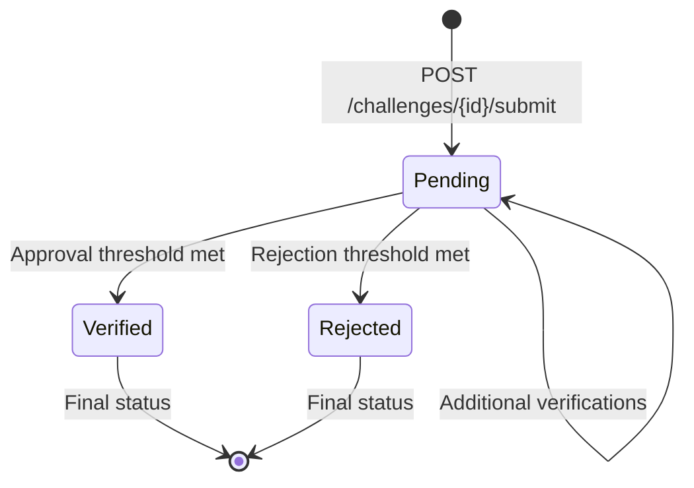
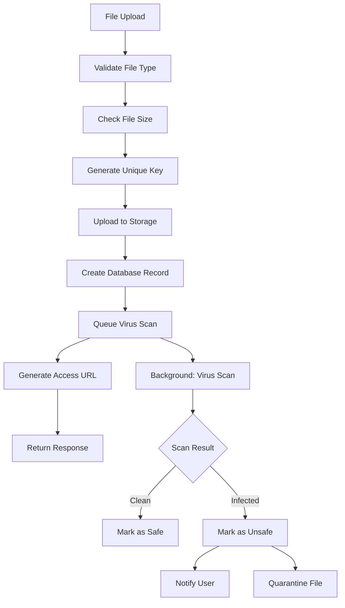

# Submissions API

## Overview

The Submissions API handles file uploads for challenge proofs, verification workflow, and submission lifecycle management. It supports multiple file formats with secure storage and processing.

## Base URL
```
http://localhost:8000/submissions
```

## Authentication
All submission endpoints require authentication with a valid access token:
```
Authorization: Bearer <access_token>
```

## Submission Lifecycle



## File Upload System

### Supported File Types
- **Images**: JPEG, PNG, GIF, WebP
- **Videos**: MP4, QuickTime (MOV), WebM
- **Documents**: PDF, TXT, Markdown

### File Size Limits
- **Images**: 10MB maximum
- **Videos**: 50MB maximum  
- **Documents**: 5MB maximum

### Storage Architecture
- Primary storage: AWS S3 or MinIO compatible storage
- CDN distribution for fast access (future enhancement)
- Automatic virus scanning (future enhancement)
- File retention: 1 year after challenge completion

## Endpoints

### Upload Submission

**Endpoint:** `POST /challenges/{challenge_id}/submit`

**Description:** Upload proof file for challenge completion.

**Request (multipart/form-data):**
```bash
curl -X POST http://localhost:8000/challenges/challenge-uuid/submit \
  -H "Authorization: Bearer TOKEN" \
  -F "file=@proof_video.mp4" \
  -F "description=Day 15 - completed 100 push-ups with perfect form" \
  -F 'metadata={"day": 15, "reps": 100, "duration_seconds": 180}'
```

**Request Parameters:**
- **file** (file, required): The proof file to upload
- **description** (string, optional): Text description of the submission (max 500 chars)
- **metadata** (JSON string, optional): Structured data relevant to the challenge

**Response (201 Created):**
```json
{
  "id": "submission-550e8400-e29b-41d4-a716-446655440000",
  "challenge_id": "550e8400-e29b-41d4-a716-446655440001",
  "participant_id": "participant-uuid",
  "user_id": "user-uuid",
  "file_key": "submissions/2024/01/15/uuid-proof_video.mp4",
  "file_url": "https://presigned-url-expires-in-1hour",
  "file_size": 15728640,
  "file_type": "video/mp4",
  "original_filename": "proof_video.mp4",
  "description": "Day 15 - completed 100 push-ups with perfect form",
  "metadata": {
    "day": 15,
    "reps": 100,
    "duration_seconds": 180,
    "uploaded_from": "mobile_app"
  },
  "status": "pending",
  "verification_count": 0,
  "approval_count": 0,
  "rejection_count": 0,
  "created_at": "2024-01-15T10:30:00Z",
  "updated_at": "2024-01-15T10:30:00Z"
}
```

**File Processing:**
1. Virus scan (queued for background processing)
2. File type validation and MIME type verification
3. Generate unique file key with timestamp and UUID
4. Upload to secure storage with appropriate permissions
5. Create database record with file metadata
6. Generate time-limited access URL (1 hour expiration)

**Error Responses:**
- **400 Bad Request**: Invalid file type, size, or not a participant
- **413 Payload Too Large**: File exceeds size limits
- **415 Unsupported Media Type**: File type not allowed
- **422 Unprocessable Entity**: File corrupted or invalid format

### Get Submission Details

**Endpoint:** `GET /submissions/{submission_id}`

**Description:** Get detailed information about a specific submission.

**Response (200 OK):**
```json
{
  "id": "submission-550e8400-e29b-41d4-a716-446655440000",
  "challenge_id": "550e8400-e29b-41d4-a716-446655440001",
  "challenge_title": "30-Day Push-up Challenge",
  "participant_id": "participant-uuid",
  "user_id": "user-uuid",
  "username": "alice",
  "file_key": "submissions/2024/01/15/uuid-proof_video.mp4",
  "file_url": "https://presigned-url-expires-in-1hour",
  "file_size": 15728640,
  "file_type": "video/mp4",
  "original_filename": "proof_video.mp4",
  "description": "Day 15 - completed 100 push-ups with perfect form",
  "metadata": {
    "day": 15,
    "reps": 100,
    "duration_seconds": 180
  },
  "status": "pending",
  "verification_count": 3,
  "approval_count": 2,
  "rejection_count": 1,
  "verification_threshold": 2,
  "is_verified": false,
  "created_at": "2024-01-15T10:30:00Z",
  "updated_at": "2024-01-15T14:20:00Z",
  "verifications": [
    {
      "id": "verification-uuid-1",
      "verifier_id": "verifier-uuid-1",
      "verifier_username": "bob",
      "verdict": "approve",
      "feedback": "Clear video, proper form demonstrated",
      "created_at": "2024-01-15T12:00:00Z"
    },
    {
      "id": "verification-uuid-2",
      "verifier_id": "verifier-uuid-2",
      "verifier_username": "charlie",
      "verdict": "reject",
      "feedback": "Could not clearly see full range of motion",
      "created_at": "2024-01-15T13:30:00Z"
    }
  ]
}
```

**Access Control:**
- Submitter can always view their own submissions
- Challenge participants can view all submissions for peer verification
- Challenge creator can view all submissions
- Public users cannot access submission details

### Update Submission

**Endpoint:** `PUT /submissions/{submission_id}`

**Description:** Update submission description or metadata (file cannot be changed).

**Request Body:**
```json
{
  "description": "Updated: Day 15 - completed 100 push-ups, added extra 20 for bonus",
  "metadata": {
    "day": 15,
    "reps": 120,
    "duration_seconds": 220,
    "bonus_reps": 20
  }
}
```

**Response (200 OK):**
```json
{
  "id": "submission-550e8400-e29b-41d4-a716-446655440000",
  "description": "Updated: Day 15 - completed 100 push-ups, added extra 20 for bonus",
  "metadata": {
    "day": 15,
    "reps": 120,
    "duration_seconds": 220,
    "bonus_reps": 20
  },
  "updated_at": "2024-01-15T15:00:00Z"
}
```

**Business Rules:**
- Only the submitter can update their submissions
- Cannot update after submission is verified or rejected
- File cannot be replaced (must create new submission)
- Description and metadata updates do not reset verification status

### Delete Submission

**Endpoint:** `DELETE /submissions/{submission_id}`

**Description:** Delete a submission (only before any verifications).

**Response (204 No Content)**

**Business Rules:**
- Only submitter can delete their submissions
- Cannot delete after any verifications received
- File is permanently removed from storage
- Action is irreversible

**Error Responses:**
- **403 Forbidden**: Cannot delete (not owner or has verifications)
- **404 Not Found**: Submission not found

### List User Submissions

**Endpoint:** `GET /submissions/my-submissions`

**Description:** Get all submissions by the authenticated user.

**Query Parameters:**
- **challenge_id** (string, optional): Filter by specific challenge
- **status** (string, optional): Filter by status (`pending`, `verified`, `rejected`)
- **limit** (integer, optional): Results per page (default: 20, max: 100)
- **offset** (integer, optional): Results to skip (default: 0)

**Response (200 OK):**
```json
{
  "submissions": [
    {
      "id": "submission-uuid-1",
      "challenge_id": "challenge-uuid-1",
      "challenge_title": "30-Day Push-up Challenge",
      "file_url": "https://presigned-url",
      "description": "Day 15 submission",
      "status": "verified",
      "verification_count": 3,
      "approval_count": 3,
      "created_at": "2024-01-15T10:30:00Z"
    }
  ],
  "total": 15,
  "limit": 20,
  "offset": 0
}
```

## Verification System

### Create Verification

**Endpoint:** `POST /submissions/{submission_id}/verify`

**Description:** Verify another participant's submission.

**Request Body:**
```json
{
  "verdict": "approve",
  "feedback": "Excellent form and technique demonstrated. Clear video quality."
}
```

**Request Parameters:**
- **verdict** (string, required): Either `approve` or `reject`
- **feedback** (string, optional): Detailed feedback (max 500 characters)

**Response (201 Created):**
```json
{
  "id": "verification-uuid",
  "submission_id": "submission-uuid",
  "verifier_id": "current-user-uuid",
  "verifier_username": "bob",
  "verdict": "approve",
  "feedback": "Excellent form and technique demonstrated. Clear video quality.",
  "created_at": "2024-01-15T14:00:00Z",
  "submission_status_updated": true,
  "new_submission_status": "verified"
}
```

**Automatic Processing:**
When verification is created:
1. Update submission verification counts
2. Check if verification threshold is met
3. If threshold met, update submission status to `verified` or `rejected`
4. If verified, update participant status to `completed`
5. Send notification to submitter
6. Check if challenge completion criteria are met

**Business Rules:**
- Cannot verify own submissions
- Cannot verify same submission multiple times
- Must be participant in the challenge
- Verification threshold determines final status
- Majority rule: More approvals = verified, more rejections = rejected

### Get Verification History

**Endpoint:** `GET /submissions/{submission_id}/verifications`

**Description:** Get all verifications for a specific submission.

**Response (200 OK):**
```json
{
  "submission_id": "submission-uuid",
  "verifications": [
    {
      "id": "verification-uuid-1",
      "verifier_id": "verifier-uuid-1",
      "verifier_username": "bob",
      "verdict": "approve",
      "feedback": "Clear video, proper form demonstrated",
      "created_at": "2024-01-15T12:00:00Z"
    },
    {
      "id": "verification-uuid-2",
      "verifier_id": "verifier-uuid-2",
      "verifier_username": "charlie",
      "verdict": "reject",
      "feedback": "Could not clearly see full range of motion",
      "created_at": "2024-01-15T13:30:00Z"
    }
  ],
  "summary": {
    "total_verifications": 2,
    "approval_count": 1,
    "rejection_count": 1,
    "verification_threshold": 2,
    "status": "pending"
  }
}
```

### Update Verification

**Endpoint:** `PUT /verifications/{verification_id}`

**Description:** Update feedback for a verification (verdict cannot be changed).

**Request Body:**
```json
{
  "feedback": "Updated feedback: Great effort, but need to see clearer angle next time."
}
```

**Response (200 OK):**
```json
{
  "id": "verification-uuid",
  "feedback": "Updated feedback: Great effort, but need to see clearer angle next time.",
  "updated_at": "2024-01-15T15:30:00Z"
}
```

**Business Rules:**
- Only the verifier can update their verification
- Cannot change verdict after creation
- Updates within 24 hours of creation only
- Feedback updates do not recalculate submission status

## File Management

### Generate New File URL

**Endpoint:** `POST /submissions/{submission_id}/generate-url`

**Description:** Generate a new time-limited access URL for the submission file.

**Response (200 OK):**
```json
{
  "file_url": "https://new-presigned-url-expires-in-1hour",
  "expires_at": "2024-01-15T16:00:00Z"
}
```

**Access Control:**
- Available to submission owner and challenge participants
- URLs expire after 1 hour for security
- Rate limited: 10 requests per hour per user

### Download File

**Endpoint:** `GET /submissions/{submission_id}/download`

**Description:** Direct file download with access control.

**Response:** 
- **200 OK**: File stream with appropriate headers
- **302 Found**: Redirect to pre-signed S3 URL

**Response Headers:**
```
Content-Type: video/mp4
Content-Length: 15728640
Content-Disposition: attachment; filename="proof_video.mp4"
Cache-Control: private, max-age=3600
```

## Advanced Features

### Batch Operations

#### Bulk Verification
**Endpoint:** `POST /submissions/bulk-verify`

**Description:** Verify multiple submissions at once (future enhancement).

**Request Body:**
```json
{
  "verifications": [
    {
      "submission_id": "submission-uuid-1",
      "verdict": "approve",
      "feedback": "Good work"
    },
    {
      "submission_id": "submission-uuid-2",
      "verdict": "reject",
      "feedback": "Unclear proof"
    }
  ]
}
```

### Analytics and Reporting

#### Submission Statistics
**Endpoint:** `GET /submissions/stats`

**Description:** Get submission statistics for the authenticated user.

**Response (200 OK):**
```json
{
  "total_submissions": 45,
  "verified_submissions": 38,
  "rejected_submissions": 4,
  "pending_submissions": 3,
  "verification_rate": 84.4,
  "average_verifications_per_submission": 2.8,
  "total_verifications_given": 127,
  "challenges_participated": 12,
  "challenges_completed": 9
}
```

### Search and Filtering

#### Advanced Submission Search
**Endpoint:** `GET /submissions/search`

**Query Parameters:**
- **q** (string): Text search in descriptions and metadata
- **challenge_id** (string): Filter by challenge
- **file_type** (string): Filter by file type (image, video, document)
- **status** (string): Filter by verification status
- **date_from** (string): ISO date for submissions after
- **date_to** (string): ISO date for submissions before
- **has_feedback** (boolean): Only submissions with verification feedback

## File Processing Pipeline

### Upload Processing Flow


### File Security Measures
- **Virus Scanning**: ClamAV integration for malware detection
- **File Type Validation**: MIME type verification beyond extension check
- **Size Limits**: Strict enforcement to prevent storage abuse
- **Access Control**: Time-limited URLs with IP restrictions
- **Content Validation**: Future ML-based content verification

## Error Handling

### Common Error Scenarios

#### File Too Large
```bash
curl -X POST http://localhost:8000/challenges/challenge-uuid/submit \
  -F "file=@huge_video.mp4"

# Response: 413 Payload Too Large
{
  "detail": "File size 75MB exceeds maximum allowed size 50MB for video files."
}
```

#### Invalid File Type
```bash
curl -X POST http://localhost:8000/challenges/challenge-uuid/submit \
  -F "file=@document.exe"

# Response: 415 Unsupported Media Type
{
  "detail": "File type 'application/x-msdownload' is not allowed. Supported types: image, video, document."
}
```

#### Cannot Verify Own Submission
```bash
curl -X POST http://localhost:8000/submissions/own-submission-uuid/verify \
  -d '{"verdict": "approve"}'

# Response: 403 Forbidden
{
  "detail": "Cannot verify your own submission."
}
```

#### Already Verified
```bash
curl -X POST http://localhost:8000/submissions/submission-uuid/verify \
  -d '{"verdict": "approve"}'

# Response: 409 Conflict
{
  "detail": "You have already verified this submission."
}
```

## Testing Examples

### Complete Submission Flow
```bash
# 1. Upload submission
SUBMISSION_ID=$(curl -X POST http://localhost:8000/challenges/$CHALLENGE_ID/submit \
  -H "Authorization: Bearer $USER_TOKEN" \
  -F "file=@proof.jpg" \
  -F "description=Challenge completed successfully" \
  | jq -r '.id')

# 2. Another participant verifies
curl -X POST http://localhost:8000/submissions/$SUBMISSION_ID/verify \
  -H "Authorization: Bearer $VERIFIER_TOKEN" \
  -H "Content-Type: application/json" \
  -d '{"verdict": "approve", "feedback": "Great work!"}'

# 3. Check verification status
curl -X GET http://localhost:8000/submissions/$SUBMISSION_ID \
  -H "Authorization: Bearer $USER_TOKEN"

# 4. Generate new file URL if needed
curl -X POST http://localhost:8000/submissions/$SUBMISSION_ID/generate-url \
  -H "Authorization: Bearer $USER_TOKEN"
```

### Batch Verification Example
```bash
# Verify multiple submissions
curl -X POST http://localhost:8000/submissions/bulk-verify \
  -H "Authorization: Bearer $VERIFIER_TOKEN" \
  -H "Content-Type: application/json" \
  -d '{
    "verifications": [
      {"submission_id": "sub1", "verdict": "approve", "feedback": "Good"},
      {"submission_id": "sub2", "verdict": "reject", "feedback": "Unclear"}
    ]
  }'
```

## Business Rules Summary

### File Upload Rules
- Maximum file sizes enforced per type
- Virus scanning for security
- Automatic file key generation with timestamps
- Time-limited access URLs (1 hour expiration)
- Permanent file deletion when submission deleted

### Verification Requirements
- Peer-to-peer verification model
- Cannot verify own submissions
- One verification per user per submission
- Configurable verification threshold per challenge
- Majority rule determines final status

### Status Transitions
- **pending** → **verified**: When approval threshold met
- **pending** → **rejected**: When rejection threshold met
- **verified/rejected**: Final states, cannot be changed
- Status changes trigger participant completion checks

### Access Control
- Submitters can view/edit their submissions
- Challenge participants can verify submissions
- Public users have no access to submission details
- Time-limited file URLs for secure access