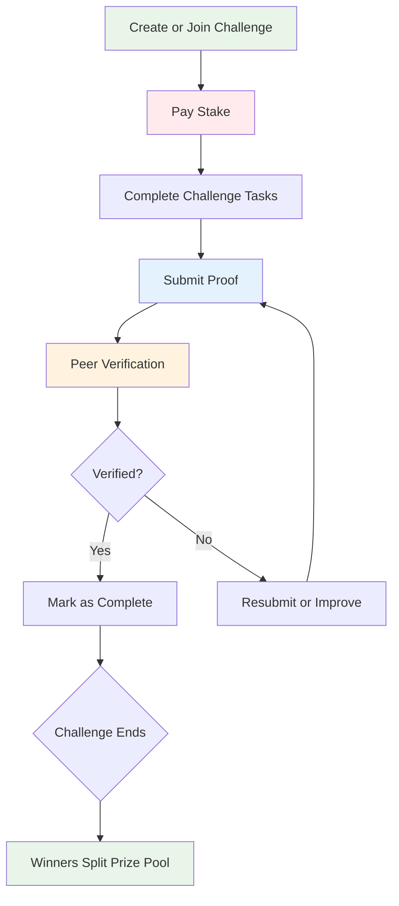

# PeerPush User Guide

## Welcome to PeerPush

PeerPush is a peer-to-peer challenge verification platform that helps you achieve your goals through community accountability and financial motivation. By putting "skin in the game" and having peers verify your progress, you're more likely to succeed in your challenges.

## Table of Contents

- [Getting Started](#getting-started)
- [Understanding the Platform](#understanding-the-platform)
- [Creating Your First Challenge](#creating-your-first-challenge)
- [Joining Challenges](#joining-challenges)
- [Making Submissions](#making-submissions)
- [Peer Verification](#peer-verification)
- [Wallet Management](#wallet-management)
- [Profile & Settings](#profile--settings)
- [Troubleshooting](#troubleshooting)
- [Community Guidelines](#community-guidelines)

## Getting Started

### Creating Your Account

1. **Visit PeerPush**: Go to [peerpush.com](https://peerpush.com) or download the mobile app
2. **Sign Up**: Click "Get Started" and enter your email and password
3. **Verify Email**: Check your inbox and click the verification link
4. **Complete Profile**: Add your username and profile information (optional)
5. **Take the Tour**: Complete the welcome tutorial to learn the basics

### Your First Deposit

To participate in challenges, you'll need tokens in your wallet:

1. **Navigate to Wallet**: Click on your balance or go to the Wallet section
2. **Choose Amount**: Select from preset amounts or enter a custom amount
3. **Add Payment Method**: Use credit card, debit card, or bank transfer
4. **Complete Purchase**: Your tokens will be available immediately

**Token Value**: 1 token = 1 USD cent (100 tokens = $1.00)

**Deposit Options**:
- **Starter Pack**: 1,000 tokens ($10) + 100 bonus tokens
- **Challenge Ready**: 2,500 tokens ($25) + 300 bonus tokens
- **Power User**: 5,000 tokens ($50) + 750 bonus tokens

## Understanding the Platform

### How PeerPush Works



### Key Concepts

#### Stakes and Prizes
- **Stake**: Money you put up front to join a challenge
- **Prize Pool**: Combined stakes from all participants
- **Winners**: Participants who successfully complete the challenge
- **Payout**: Winners split the prize pool equally

#### Verification System
- **Peer Verification**: Other participants review and approve your submissions
- **Verification Threshold**: Number of approvals needed (usually 2)
- **Community Standards**: Consistent, fair verification across all participants

#### Challenge Types
- **Fitness**: Exercise routines, step goals, weight loss
- **Learning**: Reading, skill development, courses
- **Habits**: Meditation, journaling, productivity
- **Creative**: Art projects, writing, music practice
- **Professional**: Career development, networking

### Platform Benefits

#### For Participants
- **Financial Motivation**: Real money on the line increases commitment
- **Community Support**: Connect with like-minded people pursuing similar goals
- **Accountability**: Regular check-ins and peer oversight
- **Skill Development**: Learn new habits and improve existing ones
- **Rewards**: Earn money by completing challenges successfully

#### For Challenge Creators
- **Leadership**: Guide others toward achieving their goals
- **Community Building**: Create engaged groups around shared interests
- **Expertise Sharing**: Monetize your knowledge and experience
- **Impact Measurement**: See direct results of your challenge design

## Creating Your First Challenge

### Challenge Planning

Before creating a challenge, consider:

1. **Clear Goal**: What specific outcome do you want participants to achieve?
2. **Realistic Timeline**: How long should the challenge last?
3. **Fair Stakes**: What amount motivates without excluding people?
4. **Verification Method**: How will participants prove completion?
5. **Support Level**: How much guidance will you provide?

### Step-by-Step Creation

#### 1. Basic Information
- **Title**: Clear, motivating challenge name
- **Category**: Select the most appropriate category
- **Description**: Detailed explanation of goals and benefits
- **Duration**: Challenge length (1 week to 3 months recommended)

#### 2. Challenge Rules
- **Daily Requirements**: What participants must do each day
- **Submission Guidelines**: What proof is required
- **Success Criteria**: How completion is determined
- **Equipment/Prerequisites**: What participants need to start

#### 3. Financial Setup
- **Stake Amount**: Entry fee for participants (including yourself)
- **Maximum Participants**: Limit if desired
- **Payout Structure**: Usually equal split among winners

#### 4. Launch Settings
- **Start Date**: When the challenge begins
- **Join Deadline**: Last day to join (usually same as start date)
- **Visibility**: Public or invite-only

### Example: "30-Day Morning Meditation"

```markdown
**Title**: 30-Day Morning Meditation Challenge

**Description**: 
Start your day with intention and mindfulness. Commit to 10 minutes of meditation every morning for 30 days. This challenge will help you build a sustainable meditation practice that reduces stress and improves focus.

**Daily Requirement**: 
- Meditate for 10+ minutes between 6 AM and 10 AM
- Submit photo of meditation timer/app or brief reflection

**Rules**:
- Use any meditation style (guided, silent, breathing, etc.)
- Meditation must be completed before 10 AM in your timezone
- Submit proof within 2 hours of completing meditation
- Weekend submissions allowed until 11 AM

**Success Criteria**:
- Complete at least 24 out of 30 days (80% completion rate)
- Receive verification approval from 2+ peers per submission

**Stake**: 2,500 tokens ($25)
**Duration**: 30 days
**Max Participants**: 15
```

### Publishing Your Challenge

1. **Review Everything**: Double-check all details and requirements
2. **Pay Your Stake**: Your entry fee is charged immediately
3. **Publish**: Make the challenge live and available to join
4. **Promote**: Share with friends or on social media to get participants

## Joining Challenges

### Finding the Right Challenge

#### Browse Options
- **Featured Challenges**: High-quality, popular challenges
- **Categories**: Filter by your interests (fitness, learning, habits, etc.)
- **Stake Range**: Find challenges within your budget
- **Duration**: Match your available commitment time
- **Success Rate**: Check historical completion rates

#### Challenge Details to Review
- **Creator Profile**: Experience, ratings, and previous challenges
- **Requirements**: Daily tasks and time commitment
- **Verification Process**: What proof you'll need to provide
- **Community**: Current participants and discussion activity
- **Timeline**: Start date, duration, and key milestones

### Joining Process

1. **Select Challenge**: Click on a challenge that interests you
2. **Review Details**: Read all requirements and rules carefully
3. **Check Your Balance**: Ensure you have enough tokens for the stake
4. **Confirm Participation**: Click "Join Challenge" and confirm payment
5. **Stake Payment**: Your tokens are immediately moved to the prize pool
6. **Get Ready**: You'll receive a welcome email with next steps

### Pre-Challenge Preparation

#### Set Yourself Up for Success
- **Calendar Blocking**: Schedule time for daily challenge activities
- **Preparation**: Gather any needed equipment or materials
- **Support System**: Tell friends/family about your commitment
- **Tracking Method**: Decide how you'll document your progress
- **Backup Plans**: Prepare for obstacles and difficult days

#### Understanding the Community
- **Participant Introductions**: Share your goals and motivation
- **Support Network**: Connect with other participants
- **Question Asking**: Clarify any unclear requirements
- **Encouragement**: Offer and seek motivation from peers

## Making Submissions

### Submission Requirements

#### Quality Standards
- **Clear Evidence**: Proof should clearly show task completion
- **Timely Submission**: Submit within required timeframe (usually 24 hours)
- **Honest Documentation**: Accurate representation of your effort
- **Complete Information**: Include all required elements

#### Submission Types

**Photo Submissions**:
- High resolution and good lighting
- Show relevant activity or result
- Include timestamp if required
- No editing or filters that obscure evidence

**Video Submissions**:
- Clear audio and video quality
- Show complete or representative portion of activity
- Keep within time limits (usually 30 seconds to 2 minutes)
- Stable camera work

**Text/Data Submissions**:
- Accurate metrics and measurements
- Screenshot of relevant apps or devices
- Detailed descriptions of activities
- Supporting evidence when possible

### Daily Submission Process

1. **Complete Your Challenge Task**: Finish the required activity
2. **Gather Evidence**: Take photos, videos, or collect data immediately
3. **Open Submission Form**: Access through the challenge page or app
4. **Upload Proof**: Add your photos, videos, or data
5. **Add Description**: Briefly describe what you accomplished
6. **Review and Submit**: Double-check everything before submitting
7. **Track Status**: Monitor verification progress

### Submission Best Practices

#### Photography Tips
- **Good Lighting**: Natural light works best for clear photos
- **Stable Shots**: Use timer or ask someone to help avoid blur
- **Show Context**: Include relevant background or setup
- **Multiple Angles**: When helpful, provide different perspectives

#### Video Guidelines
- **Horizontal Orientation**: Film in landscape mode when possible
- **Show Process**: Capture key moments of your activity
- **Clear Audio**: Speak clearly if narration is included
- **Edit Minimally**: Keep footage authentic and unaltered

#### Writing Effective Descriptions
- **Be Specific**: Include relevant details about your experience
- **Share Challenges**: Mention any difficulties you overcame
- **Note Improvements**: Track your progress over time
- **Stay Positive**: Maintain encouraging tone for community

### Handling Submission Issues

#### Technical Problems
- **Upload Failures**: Check internet connection and file size
- **Format Issues**: Ensure files meet platform requirements
- **App Crashes**: Force close and restart the application
- **Missing Submissions**: Contact support immediately

#### Quality Concerns
- **Unclear Proof**: Resubmit with better evidence if possible
- **Late Submissions**: Explain circumstances in description
- **Missed Days**: Focus on consistency going forward
- **Equipment Issues**: Find alternative ways to document progress

## Peer Verification

### Understanding Verification

#### Why Peer Verification Works
- **Community Standards**: Consistent application of challenge rules
- **Shared Investment**: Everyone has stakes in fair verification
- **Diverse Perspectives**: Multiple reviewers reduce bias
- **Mutual Accountability**: You verify others, they verify you

#### Verification Responsibilities
- **Fair Assessment**: Judge submissions objectively
- **Helpful Feedback**: Provide constructive comments
- **Timely Reviews**: Complete verifications promptly
- **Consistent Standards**: Apply rules equally to all participants

### How to Verify Submissions

#### Review Process
1. **Access Verification Queue**: Check your pending verifications
2. **Review Submission**: Examine photos, videos, and descriptions
3. **Compare to Requirements**: Check against challenge rules
4. **Make Decision**: Approve or request clarification
5. **Provide Feedback**: Add helpful comments
6. **Submit Verification**: Confirm your decision

#### Verification Criteria

**Approve When**:
- Clear evidence of task completion
- Meets all stated requirements
- Shows genuine effort and progress
- Follows submission guidelines

**Request Clarification When**:
- Evidence is unclear or incomplete
- Requirements appear partially met
- Additional information would help
- Technical issues affect quality

**Provide Feedback Always**:
- Acknowledge effort and progress
- Suggest improvements when appropriate
- Encourage continued participation
- Maintain positive, supportive tone

### Building Verification Reputation

#### Quality Metrics
- **Consistency**: Agreement with other verifiers
- **Timeliness**: Speed of verification completion
- **Helpfulness**: Quality of feedback provided
- **Fairness**: Balanced application of standards

#### Reputation Benefits
- **Increased Weight**: Your verifications carry more influence
- **Priority Access**: Early access to new features
- **Community Recognition**: Badges and public acknowledgment
- **Trust Building**: Other participants value your reviews

### Handling Verification Disputes

#### If Your Submission is Questioned
1. **Review Feedback**: Understand the specific concerns
2. **Provide Clarification**: Add additional information if possible
3. **Accept Decision**: Respect the verification process
4. **Learn and Improve**: Apply feedback to future submissions
5. **Appeal if Necessary**: Contact support for serious disputes

#### If You Disagree with Another's Submission
1. **Focus on Requirements**: Base decisions on stated rules
2. **Give Benefit of Doubt**: Approve when evidence is reasonable
3. **Provide Specific Feedback**: Explain your reasoning clearly
4. **Stay Professional**: Maintain respectful communication
5. **Escalate if Needed**: Report obvious violations to moderators

## Wallet Management

### Understanding Your Wallet

#### Token System
- **1 Token = 1 Cent**: Simple conversion (100 tokens = $1.00)
- **Real-Time Balance**: Updated immediately with transactions
- **Transaction History**: Complete record of all activity
- **Security Features**: Protected against unauthorized access

#### Wallet Sections
- **Available Balance**: Tokens ready for new challenges
- **Staked Tokens**: Money committed to active challenges
- **Pending Payouts**: Winnings waiting to be processed
- **Transaction History**: Detailed log of all wallet activity

### Adding Money to Your Wallet

#### Payment Methods
- **Credit Cards**: Visa, Mastercard, American Express, Discover
- **Debit Cards**: Bank debit cards with major network logos
- **Bank Transfers**: ACH transfers (2-3 business days)
- **Digital Wallets**: Apple Pay, Google Pay, PayPal (coming soon)

#### Deposit Process
1. **Choose Amount**: Select preset amount or enter custom value
2. **Payment Method**: Add or select existing payment method
3. **Review Transaction**: Confirm amount and payment details
4. **Complete Purchase**: Process payment through Stripe
5. **Instant Credit**: Tokens available immediately in your wallet

#### Deposit Limits and Fees
- **Daily Limit**: 100,000 tokens ($1,000) per day
- **Monthly Limit**: 500,000 tokens ($5,000) per month
- **Processing Fees**: 2.9% + $0.30 (absorbed by platform for now)
- **International**: Additional 1.5% for non-US cards

### Withdrawing Your Winnings

#### Withdrawal Requirements
- **Minimum Amount**: 1,000 tokens ($10)
- **Maximum Amount**: 50,000 tokens ($500) per transaction
- **Verification Required**: Identity verification for large amounts
- **Processing Time**: 2-5 business days

#### Withdrawal Process
1. **Request Withdrawal**: Specify amount to withdraw
2. **Choose Method**: Bank transfer or original payment method
3. **Verify Identity**: Complete verification if required
4. **Confirm Request**: Review all details and submit
5. **Processing**: Wait for transfer to complete

#### Withdrawal Limits
- **Daily**: $500 maximum
- **Weekly**: $2,000 maximum
- **Monthly**: $5,000 maximum
- **Annual**: $50,000 maximum (with identity verification)

### Managing Active Stakes

#### Staked Token Tracking
- **Challenge Name**: Which challenge holds your stake
- **Amount**: How much you've committed
- **Status**: Whether challenge is active or completed
- **Expected Return**: Potential winnings based on current participants

#### Stake Management
- **Cannot Withdraw**: Staked tokens are locked until challenge ends
- **No Partial Refunds**: Stakes are only returned if challenge is cancelled
- **Automatic Distribution**: Winnings are credited automatically
- **Challenge History**: Track all your past participations

### Transaction Security

#### Security Measures
- **Encrypted Storage**: All financial data encrypted at rest
- **Secure Transmission**: SSL/TLS for all communication
- **Fraud Detection**: Automated monitoring for suspicious activity
- **Two-Factor Authentication**: Optional 2FA for wallet access

#### Monitoring Your Account
- **Regular Reviews**: Check transactions weekly
- **Unexpected Charges**: Report immediately to support
- **Password Security**: Use strong, unique passwords
- **Device Security**: Log out from shared or public devices

## Profile & Settings

### Personal Profile

#### Profile Information
- **Username**: Public identifier (can be changed once per month)
- **Display Name**: Friendly name shown in challenges
- **Profile Picture**: Avatar image (optional)
- **Bio**: Short description about yourself and goals
- **Location**: General location (city/state, optional)

#### Privacy Settings
- **Profile Visibility**: Public, friends only, or private
- **Challenge History**: Show past challenges and results
- **Statistics Display**: Share completion rates and achievements
- **Contact Preferences**: Allow direct messages from other users

### Notification Preferences

#### Email Notifications
- **Challenge Updates**: New participants, submissions, completions
- **Verification Requests**: When your submissions need verification
- **Payout Notifications**: When you receive winnings
- **Platform Updates**: New features and important announcements

#### Push Notifications (Mobile App)
- **Daily Reminders**: Submission deadlines and motivation
- **Peer Activity**: When others verify your submissions
- **Challenge Milestones**: Progress updates and achievements
- **Social Features**: Friend requests and messages

#### Notification Timing
- **Quiet Hours**: Set times when notifications are paused
- **Time Zone**: Ensure notifications arrive at appropriate times
- **Frequency Limits**: Prevent notification overload
- **Emergency Override**: Critical notifications still get through

### Account Security

#### Password Management
- **Strong Passwords**: Use complex, unique passwords
- **Regular Updates**: Change passwords periodically
- **Password Manager**: Use tools to generate and store passwords
- **No Sharing**: Never share login credentials

#### Two-Factor Authentication
- **Setup Process**: Add phone number or authenticator app
- **Login Protection**: Require code for account access
- **Recovery Codes**: Save backup codes in secure location
- **Device Management**: Remove access from old devices

#### Account Recovery
- **Email Recovery**: Reset password through email verification
- **Phone Recovery**: Use SMS for account access
- **Security Questions**: Backup verification method
- **Support Contact**: Last resort for locked accounts

### Achievements and Badges

#### Achievement Types
- **Completion Badges**: First challenge, perfect streak, comeback story
- **Community Badges**: Helpful verifier, challenge creator, mentor
- **Milestone Badges**: 10 challenges, $100 earned, 1 year active
- **Special Recognition**: Featured participant, community choice

#### Badge Benefits
- **Profile Display**: Show off your accomplishments
- **Community Status**: Increased credibility and trust
- **Special Access**: Early features, exclusive challenges
- **Reward Points**: Bonus tokens or discounts

## Troubleshooting

### Common Issues

#### Login Problems
**Symptom**: Cannot access your account
**Solutions**:
1. Check email and password spelling
2. Use "Forgot Password" link to reset
3. Clear browser cache and cookies
4. Try different browser or device
5. Contact support if issues persist

#### Submission Upload Failures
**Symptom**: Cannot upload photos or videos
**Solutions**:
1. Check internet connection strength
2. Reduce file size (compress images/videos)
3. Try different file format
4. Close and restart app
5. Switch between WiFi and mobile data

#### Verification Delays
**Symptom**: Submissions pending verification too long
**Solutions**:
1. Be patient - verifiers have 48 hours
2. Check if submission meets all requirements
3. Engage with community to encourage participation
4. Contact challenge creator for guidance
5. Report to support if repeatedly delayed

#### Payment Issues
**Symptom**: Deposit or withdrawal problems
**Solutions**:
1. Verify payment method details
2. Check bank account/card balance
3. Contact your bank about transaction blocks
4. Try alternative payment method
5. Reach out to support with transaction details

### Getting Help

#### Self-Service Resources
- **FAQ Section**: Answers to common questions
- **Video Tutorials**: Step-by-step guides for key features
- **Community Forum**: Peer support and discussions
- **Help Articles**: Detailed explanations of platform features

#### Contacting Support
- **In-App Help**: Chat support within the application
- **Email Support**: support@peerpush.com (24-48 hour response)
- **Phone Support**: Available for urgent issues (business hours)
- **Social Media**: Twitter @PeerPushSupport for quick questions

#### Escalation Process
1. **First Contact**: Describe issue clearly with relevant details
2. **Information Gathering**: Provide requested screenshots or data
3. **Investigation**: Allow time for technical team review
4. **Resolution**: Implement solution or explanation
5. **Follow-up**: Confirm issue is resolved to satisfaction

## Community Guidelines

### Respectful Participation

#### Core Values
- **Mutual Respect**: Treat all participants with courtesy and kindness
- **Honest Engagement**: Submit authentic proof and fair verifications
- **Supportive Community**: Encourage others and celebrate successes
- **Inclusive Environment**: Welcome people of all backgrounds and abilities

#### Communication Standards
- **Constructive Feedback**: Focus on helping others improve
- **Positive Language**: Maintain encouraging and motivational tone
- **No Harassment**: Zero tolerance for bullying or discrimination
- **Privacy Respect**: Don't share personal information without permission

### Fair Play Expectations

#### Submission Integrity
- **Authentic Proof**: Submit real evidence of your actual progress
- **No Cheating**: Don't fake activities or manipulate evidence
- **Honest Reporting**: Accurately describe your efforts and results
- **Own Work**: Don't submit someone else's activities as your own

#### Verification Fairness
- **Objective Review**: Base decisions on requirements, not personal bias
- **Consistent Standards**: Apply rules equally to all participants
- **Helpful Feedback**: Provide constructive comments for improvement
- **Timely Reviews**: Complete verifications within reasonable time

### Consequences for Violations

#### Warning System
- **First Offense**: Educational warning and guidance
- **Second Offense**: Temporary restrictions on participation
- **Repeated Violations**: Extended suspension or account termination
- **Severe Violations**: Immediate account suspension

#### Appeal Process
- **Review Request**: Submit appeal through support system
- **Evidence Submission**: Provide relevant information or context
- **Investigation**: Platform team reviews case thoroughly
- **Final Decision**: Resolution communicated within 5 business days

---

**Welcome to the PeerPush community! We're excited to help you achieve your goals through the power of peer accountability and financial motivation. Remember, every challenge is an opportunity to grow, learn, and connect with others who share your commitment to personal improvement.**

*For additional support, visit our [Help Center](https://help.peerpush.com) or contact us at support@peerpush.com*