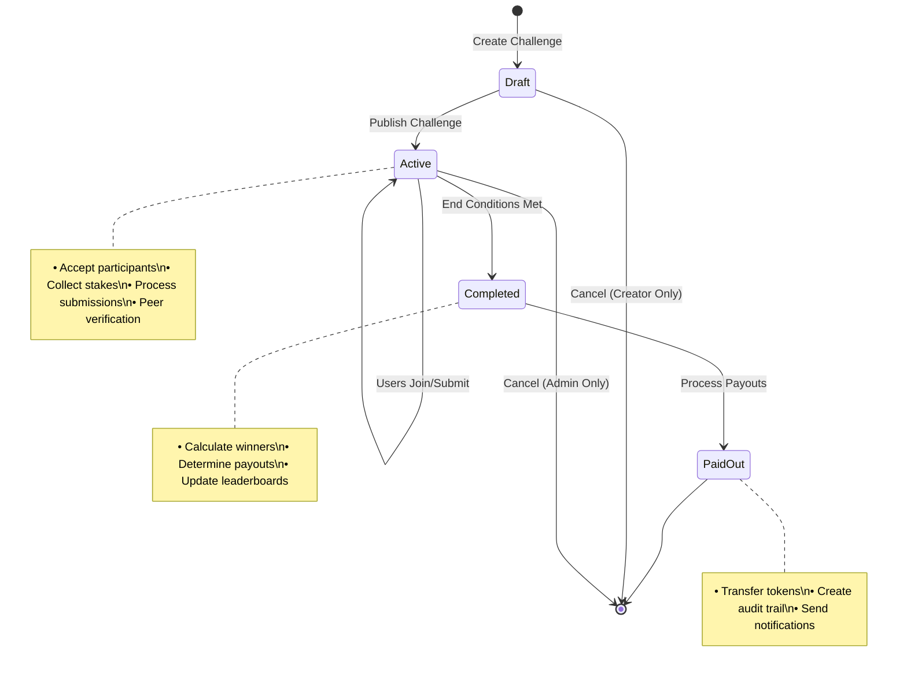

# Challenge System

## Overview

The challenge system is the core of PeerPush, enabling users to create skill-based challenges that require peer verification for completion. The system handles the complete lifecycle from challenge creation to payout distribution.

## Challenge Lifecycle



## Challenge Types

### 1. Skill Challenges
- **Fitness**: Push-ups, running, weight lifting
- **Creative**: Art, music, writing
- **Educational**: Learning milestones, certifications
- **Professional**: Code commits, sales targets

### 2. Duration Types
- **Time-bound**: Fixed start/end dates
- **Open-ended**: No specific end date
- **Milestone-based**: Ends when criteria met

### 3. Verification Methods
- **Peer Verification**: Community members verify submissions
- **Self-Reporting**: Honor system with spot checks
- **Automated**: Future integration with APIs/devices

## Core Components

### Challenge Schema

```sql
CREATE TABLE challenges (
    id UUID PRIMARY KEY DEFAULT gen_random_uuid(),
    creator_id UUID NOT NULL REFERENCES users(id),
    title VARCHAR(255) NOT NULL,
    description TEXT,
    rules TEXT,
    stake_amount INTEGER NOT NULL CHECK (stake_amount > 0),
    max_participants INTEGER CHECK (max_participants > 0),
    start_date TIMESTAMP WITH TIME ZONE,
    end_date TIMESTAMP WITH TIME ZONE,
    status VARCHAR(20) DEFAULT 'draft' CHECK (status IN ('draft', 'active', 'completed', 'cancelled', 'paid_out')),
    verification_threshold INTEGER DEFAULT 2 CHECK (verification_threshold > 0),
    created_at TIMESTAMP WITH TIME ZONE DEFAULT NOW(),
    updated_at TIMESTAMP WITH TIME ZONE DEFAULT NOW()
);
```

### Participation Schema

```sql
CREATE TABLE participants (
    id UUID PRIMARY KEY DEFAULT gen_random_uuid(),
    challenge_id UUID NOT NULL REFERENCES challenges(id) ON DELETE CASCADE,
    user_id UUID NOT NULL REFERENCES users(id),
    status VARCHAR(20) DEFAULT 'active' CHECK (status IN ('active', 'completed', 'failed', 'withdrawn')),
    joined_at TIMESTAMP WITH TIME ZONE DEFAULT NOW(),
    completed_at TIMESTAMP WITH TIME ZONE,
    UNIQUE(challenge_id, user_id)
);
```

### Submission Schema

```sql
CREATE TABLE submissions (
    id UUID PRIMARY KEY DEFAULT gen_random_uuid(),
    challenge_id UUID NOT NULL REFERENCES challenges(id) ON DELETE CASCADE,
    participant_id UUID NOT NULL REFERENCES participants(id) ON DELETE CASCADE,
    file_key VARCHAR(255),
    description TEXT,
    metadata JSONB,
    status VARCHAR(20) DEFAULT 'pending' CHECK (status IN ('pending', 'verified', 'rejected')),
    created_at TIMESTAMP WITH TIME ZONE DEFAULT NOW()
);
```

### Verification Schema

```sql
CREATE TABLE verifications (
    id UUID PRIMARY KEY DEFAULT gen_random_uuid(),
    submission_id UUID NOT NULL REFERENCES submissions(id) ON DELETE CASCADE,
    verifier_id UUID NOT NULL REFERENCES users(id),
    verdict VARCHAR(20) NOT NULL CHECK (verdict IN ('approve', 'reject')),
    feedback TEXT,
    created_at TIMESTAMP WITH TIME ZONE DEFAULT NOW(),
    UNIQUE(submission_id, verifier_id)
);
```

## Challenge Operations

### 1. Challenge Creation

**Process**: User creates challenge → stake debited → challenge becomes available

```python
# Example: Create fitness challenge
challenge_data = {
    "title": "30-Day Push-up Challenge",
    "description": "Complete 100 push-ups daily for 30 days",
    "stake_amount": 50,  # 50 tokens ($0.50)
    "max_participants": 20,
    "verification_threshold": 2  # Requires 2 peer verifications
}

# Business Rules:
# 1. Creator must have sufficient tokens for stake
# 2. Stake is immediately debited from creator's wallet
# 3. Challenge starts in 'draft' status
# 4. Creator can modify draft challenges
```

### 2. Challenge Joining

**Process**: User joins challenge → stake debited → participant record created

```python
# Example: User joins challenge
participation_data = {
    "challenge_id": "challenge-uuid",
    "user_id": "user-uuid"
}

# Business Rules:
# 1. User must have sufficient tokens for stake
# 2. Cannot join own challenges
# 3. Cannot join if max_participants reached
# 4. Cannot join after challenge ends
# 5. Stake immediately debited from wallet
```

### 3. Submission Process

**Process**: Participant uploads proof → submission created → verification begins

```python
# Example: Submit workout video
submission_data = {
    "challenge_id": "challenge-uuid",
    "file_upload": workout_video,
    "description": "Day 15 - 100 push-ups completed",
    "metadata": {
        "day": 15,
        "reps": 100,
        "duration_seconds": 180
    }
}

# Business Rules:
# 1. Only active participants can submit
# 2. File size limits enforced (50MB default)
# 3. Supported formats: images, videos, documents
# 4. Multiple submissions allowed per challenge
# 5. Submissions stored in S3/MinIO with signed URLs
```

### 4. Peer Verification

**Process**: Community verifies submissions → verdicts recorded → completion status updated

```python
# Example: Verify submission
verification_data = {
    "submission_id": "submission-uuid",
    "verdict": "approve",  # or "reject"
    "feedback": "Great form! Counted all 100 push-ups correctly."
}

# Business Rules:
# 1. Cannot verify own submissions
# 2. Cannot verify same submission twice
# 3. Requires minimum threshold verifications (default: 2)
# 4. Majority verdict determines outcome
# 5. Verifiers can provide optional feedback
```

## Challenge Completion Logic

### Completion Criteria
A participant is marked as "completed" when:
1. **Verification Threshold Met**: Minimum number of verifications received
2. **Majority Approval**: More approvals than rejections
3. **Timeline Compliance**: Submitted within challenge timeframe

### Example Verification Flow
```python
# Challenge requires 3 verifications for completion
# Submission receives: Approve, Approve, Reject
# Result: 2/3 approve (66%) = COMPLETED

# Submission receives: Reject, Reject, Approve  
# Result: 1/3 approve (33%) = FAILED

# Submission receives: Approve, Reject (only 2 verifications)
# Result: 1/2 approve (50%) = PENDING (needs more verifications)
```

### Challenge End Conditions
Challenges end when:
1. **End Date Reached**: Time-bound challenges automatically end
2. **All Participants Complete**: Everyone finished or failed
3. **Manual Closure**: Admin intervention
4. **Cancellation**: Creator or admin cancels

## Payout System

### Payout Distribution Logic

```python
def calculate_payouts(challenge):
    total_stake_pool = challenge.stake_amount * len(challenge.participants)
    successful_participants = get_completed_participants(challenge)
    
    if len(successful_participants) == 0:
        # No winners - platform keeps all stakes
        return create_platform_revenue(total_stake_pool, challenge)
    
    # Equal distribution among winners
    payout_per_winner = total_stake_pool // len(successful_participants)
    
    for participant in successful_participants:
        credit_tokens(participant.user_id, payout_per_winner)
        create_ledger_entry(challenge, participant, payout_per_winner)
```

### Payout Scenarios

#### Scenario 1: All Participants Succeed
- **Stakes**: 5 users × 50 tokens = 250 tokens
- **Winners**: 5 users complete successfully  
- **Payout**: 250 ÷ 5 = 50 tokens each (break even)

#### Scenario 2: Partial Success
- **Stakes**: 10 users × 100 tokens = 1,000 tokens
- **Winners**: 3 users complete successfully
- **Payout**: 1,000 ÷ 3 = 333 tokens each (profit for winners)

#### Scenario 3: No Success (Platform Revenue)
- **Stakes**: 8 users × 75 tokens = 600 tokens  
- **Winners**: 0 users complete successfully
- **Platform Revenue**: 600 tokens to platform treasury

### Ledger Integration

All challenge financial activity is recorded in the ledger system:

```python
# Example ledger entries for a challenge
STAKE_ENTRY = {
    "challenge_id": "challenge-uuid",
    "participant_id": "user-uuid", 
    "amount": -50,  # Negative for stakes
    "type": "STAKE",
    "description": "Challenge stake payment"
}

PAYOUT_ENTRY = {
    "challenge_id": "challenge-uuid",
    "participant_id": "winner-uuid",
    "amount": 167,  # Positive for payouts
    "type": "PAYOUT", 
    "description": "Challenge completion payout"
}

PLATFORM_REVENUE = {
    "challenge_id": "challenge-uuid",
    "participant_id": "00000000-0000-0000-0000-000000000000",  # Platform UUID
    "amount": 400,  # Positive for platform
    "type": "PLATFORM_REVENUE",
    "description": "Forfeited stakes from failed challenge"
}
```

## Advanced Features

### Redis Caching
Challenge state and leaderboards cached in Redis for performance:

```python
# Cache challenge leaderboard
challenge_key = f"challenge:{challenge_id}:leaderboard"
redis.setex(challenge_key, 3600, json.dumps(leaderboard_data))

# Cache verification counts
verification_key = f"submission:{submission_id}:verification_count"
redis.incr(verification_key)
```

### Real-time Updates
WebSocket integration for live challenge updates:
- New participant joins
- Submission uploaded
- Verification completed
- Challenge status changes

### Anti-Gaming Measures
- **Sybil Attack Prevention**: IP and device fingerprinting
- **Collusion Detection**: Pattern analysis of verification behavior
- **Quality Thresholds**: Minimum submission quality requirements
- **Reputation System**: Verifier reliability scoring

## Business Rules Summary

### Stake Management
1. **Pre-payment Required**: Stakes debited immediately on join/create
2. **No Refunds**: Stakes only refunded if platform cancels challenge
3. **Equal Stakes**: All participants pay same amount
4. **Winner Takes All**: Total pool distributed among successful participants

### Verification Rules
1. **Peer-based**: Community members verify each other
2. **Threshold-based**: Configurable minimum verifications required
3. **Majority Rule**: More approvals than rejections = success
4. **No Self-verification**: Cannot verify own submissions
5. **One Vote**: Each verifier gets one vote per submission

### Timeline Rules
1. **Flexible Start**: Challenges can start when published or at scheduled time
2. **Fixed End**: End dates are enforced automatically
3. **Late Submissions**: Not accepted after end date
4. **Grace Period**: 24-hour verification window after challenge ends

### Financial Rules
1. **Transparent Pool**: Total stake pool visible to participants
2. **Equal Distribution**: Winners share pool equally
3. **Platform Revenue**: Failed challenges contribute to platform treasury
4. **Audit Trail**: All financial operations logged immutably

## Error Handling

### Common Errors
- **Insufficient Funds**: User lacks tokens for stake
- **Challenge Full**: Maximum participants reached
- **Invalid Submission**: File type/size violations
- **Verification Conflict**: Split verdict resolution
- **Timeline Violations**: Late submissions/verifications

### Recovery Mechanisms
- **Automatic Retries**: For transient failures
- **Manual Review**: For complex verification disputes
- **Admin Override**: For exceptional circumstances
- **Refund Process**: For platform-caused issues

## Future Enhancements

### Planned Features
1. **Team Challenges**: Group-based competitions
2. **Recurring Challenges**: Monthly/weekly repeat challenges
3. **Skill Levels**: Beginner/intermediate/advanced tiers
4. **Mentorship**: Expert guidance within challenges
5. **Achievement System**: Badges and milestone tracking

### Technical Improvements
1. **ML Verification**: Automated content verification
2. **Video Analysis**: Computer vision for fitness challenges
3. **IoT Integration**: Wearable device data integration
4. **Blockchain**: Immutable verification records
5. **Mobile SDK**: Native mobile app integration