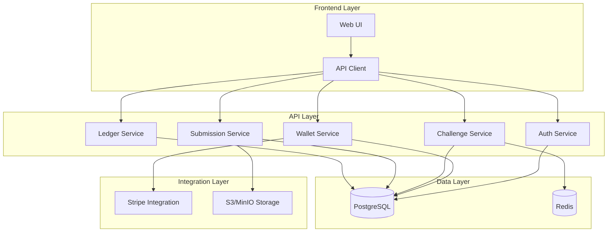

# System Overview

## Architecture Overview

PeerPush is a peer-to-peer challenge verification platform built with a microservices-inspired architecture using FastAPI, PostgreSQL, and Redis.



## Core Components

### 1. Authentication System
- **JWT-based authentication** with access/refresh token pairs
- **Access tokens**: 15-minute expiry for security
- **Refresh tokens**: 7-day expiry for user convenience
- **User management**: Registration, login, profile management

### 2. Wallet System (M7 Implementation)
- **FIFO Token Allocation**: First-in, first-out withdrawal ordering
- **Advisory Locks**: PostgreSQL advisory locks for ACID compliance
- **Dual Table Design**: 
  - `wallet_allocations`: Individual deposit lots with metadata
  - `wallet_refunds`: FIFO refund tracking against deposits
- **Daily Limits**: Configurable deposit limits (default: $1,000/day)

### 3. Challenge System
- **Lifecycle Management**: Draft → Active → Completed → Paid Out
- **Stake Integration**: Automatic stake deduction on join/creation
- **Peer Verification**: Community-driven submission verification
- **Redis Caching**: Challenge state and leaderboards

### 4. Payment Processing
- **Stripe Integration**: PCI-compliant payment processing
- **Webhook Handling**: Real-time payment confirmation
- **Refund System**: FIFO-based refunds to original payment methods
- **Currency**: USD with 1 token = 1 cent precision

### 5. Platform Revenue System
- **Forfeited Stake Capture**: Automatic revenue when challenges fail
- **Platform Ledger**: Application-wide transaction tracking
- **Revenue Analytics**: Statistics and reporting endpoints
- **Audit Trail**: Complete financial transaction history

## Environment Setup

### Required Environment Variables

```bash
# Core Application
ENVIRONMENT=dev
APP_NAME=peerpush-api
APP_VERSION=0.1.0
API_HOST=0.0.0.0
API_PORT=8000
CORS_ORIGINS=*

# Database
DATABASE_URL=postgresql+asyncpg://postgres:postgres@db:5432/peerpush_dev
REDIS_URL=redis://redis:6379/0

# Authentication
JWT_SECRET=your-jwt-secret-here
ACCESS_TTL_MIN=15
REFRESH_TTL_MIN=10080

# File Storage
S3_ENDPOINT=http://minio:9000
S3_ACCESS_KEY=minioadmin
S3_SECRET_KEY=minioadmin
S3_BUCKET_UPLOADS=peerpush-uploads-dev

# Payment Processing
STRIPE_SECRET_KEY=sk_test_...
STRIPE_WEBHOOK_SECRET=whsec_...

# Token Configuration
TOKEN_PRICE_USD_CENTS=1
MAX_DEPOSIT_TOKENS_DAY=100000
WITHDRAW_MODE=refund
REFUND_WINDOW_DAYS=90

# Security
OVERLAY_SECRET=your-overlay-secret-here
```

## Database Schema Overview

### Core Tables
- **`users`**: User accounts and profiles
- **`challenges`**: Challenge definitions and state
- **`participants`**: Challenge participation tracking
- **`submissions`**: User submission data and metadata
- **`verifications`**: Peer verification records

### Financial Tables
- **`wallet_entries`**: All wallet transactions (deposits, stakes, payouts)
- **`wallet_allocations`**: Individual deposit lots for FIFO tracking
- **`wallet_refunds`**: Refund records against original deposits
- **`ledger_entries`**: Challenge-specific financial transactions

### Key Constraints
- **Sign Constraints**: Ensure correct transaction direction (+ deposits, - stakes)
- **Foreign Key Constraints**: Maintain referential integrity
- **Unique Constraints**: Prevent duplicate transactions
- **Check Constraints**: Validate transaction amounts and states

## Security Model

### Authentication Flow
1. User registers with email/password
2. Password hashed using bcrypt
3. Login returns JWT access + refresh token pair
4. Access token required for protected endpoints
5. Refresh token used to obtain new access tokens

### Financial Security
- **Advisory Locks**: Prevent concurrent wallet modifications
- **Idempotency**: Stripe webhook events processed once only
- **ACID Transactions**: Database transactions ensure consistency
- **Audit Trail**: All financial operations logged immutably

### Data Protection
- **Input Validation**: Pydantic schemas validate all inputs
- **SQL Injection Prevention**: SQLAlchemy ORM parameterized queries
- **File Upload Security**: S3/MinIO with signed URLs
- **CORS Configuration**: Configurable cross-origin access

## Scalability Considerations

### Current Architecture
- **Vertical Scaling**: Single FastAPI instance with PostgreSQL
- **Caching**: Redis for challenge state and session data
- **File Storage**: S3/MinIO for media uploads
- **Database Pooling**: SQLAlchemy async connection pooling

### Future Scaling
- **Horizontal API Scaling**: Multiple FastAPI instances behind load balancer
- **Database Scaling**: Read replicas and connection pooling
- **Microservices**: Split services by domain (auth, wallet, challenges)
- **Event Sourcing**: Event-driven architecture for financial operations

## Monitoring and Observability

### Logging
- **Structured Logging**: JSON format for machine parsing
- **Request Tracking**: X-Request-ID headers for tracing
- **Error Tracking**: Exception handling and reporting
- **Audit Logs**: Financial transaction logging

### Metrics (Future)
- **Application Metrics**: Response times, error rates
- **Business Metrics**: Challenge completion rates, revenue
- **Infrastructure Metrics**: Database performance, API load
- **Financial Metrics**: Token flow, wallet balances