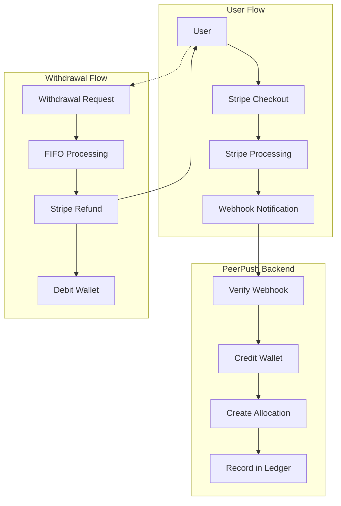

# Payment Processing

## Overview

PeerPush integrates with Stripe for secure, PCI-compliant payment processing. The system handles deposits via Stripe Checkout and refunds via the Stripe Refunds API, maintaining a complete audit trail of all financial transactions.

## Architecture



## Stripe Integration

### Configuration

```python
# Environment Variables
STRIPE_SECRET_KEY=sk_test_...           # Stripe secret key
STRIPE_WEBHOOK_SECRET=whsec_...         # Webhook signing secret
TOKEN_PRICE_USD_CENTS=1                 # 1 token = 1 cent
WITHDRAW_MODE=refund                    # refund|disabled
REFUND_WINDOW_DAYS=90                   # Refund eligibility window
```

### API Keys Management
- **Test Mode**: Uses `sk_test_` and `pk_test_` keys for development
- **Live Mode**: Uses `sk_live_` and `pk_live_` keys for production
- **Webhook Secrets**: Different secrets for test and live endpoints
- **Key Rotation**: Support for rotating keys without downtime

## Deposit Flow

### 1. Checkout Session Creation

```python
@router.post("/wallet/deposit/checkout", response_model=CreateDepositResponse)
async def create_deposit_checkout(payload: CreateDepositRequest, user=Depends(get_current_user)):
    """Create Stripe checkout session for token purchase."""
    
    # Validate input
    if payload.tokens <= 0:
        raise HTTPException(status_code=400, detail="tokens must be > 0")
    
    # Check daily deposit limit
    if not await check_daily_deposit_limit(session, user.id, payload.tokens):
        raise HTTPException(status_code=400, detail="Daily deposit limit exceeded")
    
    # Calculate USD amount (1 token = 1 cent)
    amount_cents = payload.tokens * settings.token_price_usd_cents
    
    # Create Stripe checkout session
    stripe_session = stripe.checkout.Session.create(
        mode="payment",
        line_items=[{
            "price_data": {
                "currency": "usd",
                "product_data": {"name": f"{payload.tokens} PeerPush Tokens"},
                "unit_amount": amount_cents,
            },
            "quantity": 1,
        }],
        payment_intent_data={
            "metadata": {"user_id": str(user.id), "tokens": payload.tokens}
        },
        client_reference_id=str(user.id),
        success_url=str(payload.success_url) + "?session_id={CHECKOUT_SESSION_ID}",
        cancel_url=str(payload.cancel_url),
    )
    
    return CreateDepositResponse(
        checkout_url=stripe_session["url"], 
        session_id=stripe_session["id"]
    )
```

### 2. Webhook Processing

```python
@router.post("/stripe/webhook")
async def stripe_webhook(request: Request, stripe_signature: str = Header(None)):
    """Process Stripe webhook events."""
    
    # Verify webhook signature
    payload = await request.body()
    try:
        event = stripe.Webhook.construct_event(
            payload=payload.decode("utf-8"),
            sig_header=stripe_signature or "",
            secret=settings.stripe_webhook_secret,
        )
    except Exception as e:
        raise HTTPException(status_code=400, detail=f"Invalid webhook: {e}")
    
    # Handle checkout.session.completed event
    if event["type"] == "checkout.session.completed":
        session_data = event["data"]["object"]
        
        if session_data.get("payment_status") == "paid":
            # Extract payment information
            payment_intent_id = session_data.get("payment_intent")
            user_id = session_data.get("client_reference_id")
            amount_cents = int(session_data.get("amount_total") or 0)
            
            if payment_intent_id and user_id and amount_cents > 0:
                # Credit tokens to user wallet (idempotent)
                created = await credit_deposit_idempotent(
                    db, 
                    user_id=UUID(user_id), 
                    external_id=payment_intent_id, 
                    usd_cents=amount_cents
                )
                
                if created:
                    await db.commit()
                    logger.info(f"Credited {amount_cents//settings.token_price_usd_cents} tokens to user {user_id}")
    
    return {"ok": True}
```

### 3. Idempotent Token Crediting

```python
async def credit_deposit_idempotent(session: AsyncSession, user_id: UUID, 
                                   external_id: str, usd_cents: int) -> bool:
    """Credit tokens based on fiat received. Idempotent by external_id."""
    
    if usd_cents <= 0:
        return False
    
    # Calculate tokens (1 token = 1 cent by default)
    tokens = usd_cents // max(1, settings.token_price_usd_cents)
    if tokens <= 0:
        return False
    
    # Check if already processed (idempotency)
    exists = await session.scalar(
        select(WalletEntry).where(WalletEntry.external_id == external_id)
    )
    if exists:
        return False  # Already processed
    
    # Create wallet entry
    wallet_entry = WalletEntry(
        user_id=user_id,
        type="DEPOSIT",
        amount=tokens,
        currency="usd",
        external_id=external_id,
        note="stripe_deposit",
    )
    session.add(wallet_entry)
    await session.flush()  # Get entry ID
    
    # Create allocation lot for FIFO tracking
    allocation = WalletAllocation(
        user_id=user_id,
        original_amount=tokens,
        remaining_amount=tokens,
        payment_intent_id=external_id,
        deposit_entry_id=wallet_entry.id
    )
    session.add(allocation)
    
    return True
```

## Withdrawal Flow

### 1. Withdrawal Request

```python
@router.post("/wallet/withdraw", response_model=WithdrawResponse)
async def withdraw_tokens(payload: WithdrawRequest, user=Depends(get_current_user)):
    """Withdraw tokens back to card via Stripe refunds (FIFO by deposit lots)."""
    
    if payload.tokens <= 0:
        raise HTTPException(status_code=400, detail="tokens must be > 0")
    
    # Check withdrawal mode
    if settings.withdraw_mode != "refund":
        raise HTTPException(status_code=503, detail="Withdrawals currently disabled")
    
    # Check current balance
    current_balance = await wallet_balance(session, user.id)
    if current_balance < payload.tokens:
        raise HTTPException(
            status_code=400, 
            detail=f"Insufficient balance. Have {current_balance}, need {payload.tokens}"
        )
    
    # Check refund window
    if not await validate_refund_window(session, user.id, payload.tokens):
        raise HTTPException(
            status_code=400, 
            detail=f"Tokens outside {settings.refund_window_days}-day refund window"
        )
    
    # Process FIFO withdrawal
    result = await process_fifo_withdrawal(session, user.id, payload.tokens)
    await session.commit()
    
    return WithdrawResponse(
        requested=result["requested"],
        refunded=result["refunded"], 
        stripe_refunds=result["stripe_refunds"]
    )
```

### 2. FIFO Refund Processing

```python
async def process_fifo_withdrawal(session: AsyncSession, user_id: UUID, amount: int) -> dict:
    """Process withdrawal using FIFO refunds to original payment methods."""
    
    # Acquire advisory lock for this user
    lock_id = hash(str(user_id)) % (2**31)
    await session.execute(text("SELECT pg_advisory_lock(:lock_id)"), {"lock_id": lock_id})
    
    try:
        # Get refund window cutoff
        window_start = datetime.now(timezone.utc) - timedelta(days=settings.refund_window_days)
        
        # Get allocations in FIFO order (within refund window)
        allocations = await session.execute(
            select(WalletAllocation)
            .where(WalletAllocation.user_id == user_id)
            .where(WalletAllocation.remaining_amount > 0)
            .where(WalletAllocation.created_at >= window_start)
            .order_by(WalletAllocation.created_at.asc())
        )
        
        # Process refunds in FIFO order
        remaining_to_withdraw = amount
        stripe_refunds = []
        refund_records = []
        
        for allocation in allocations.scalars():
            if remaining_to_withdraw <= 0:
                break
            
            # Calculate refund amount for this allocation
            refund_amount = min(remaining_to_withdraw, allocation.remaining_amount)
            refund_cents = refund_amount * settings.token_price_usd_cents
            
            # Create Stripe refund
            try:
                stripe_refund = stripe.Refund.create(
                    payment_intent=allocation.payment_intent_id,
                    amount=refund_cents
                )
                
                # Update allocation
                allocation.remaining_amount -= refund_amount
                
                # Prepare refund record
                refund_records.append({
                    "allocation_id": allocation.id,
                    "amount": refund_amount,
                    "stripe_refund_id": stripe_refund.id
                })
                
                stripe_refunds.append(stripe_refund.id)
                remaining_to_withdraw -= refund_amount
                
            except stripe.error.StripeError as e:
                logger.error(f"Stripe refund failed for allocation {allocation.id}: {e}")
                # Continue with remaining allocations
                continue
        
        # Create withdrawal entry
        actual_withdrawn = amount - remaining_to_withdraw
        if actual_withdrawn > 0:
            withdrawal_entry = WalletEntry(
                user_id=user_id,
                type="WITHDRAWAL",
                amount=-actual_withdrawn,
                note=f"Withdrawal via {len(stripe_refunds)} Stripe refund(s)"
            )
            session.add(withdrawal_entry)
            await session.flush()
            
            # Create refund records
            for record in refund_records:
                wallet_refund = WalletRefund(
                    user_id=user_id,
                    allocation_id=record["allocation_id"],
                    amount=record["amount"],
                    stripe_refund_id=record["stripe_refund_id"],
                    withdrawal_entry_id=withdrawal_entry.id
                )
                session.add(wallet_refund)
        
        return {
            "requested": amount,
            "refunded": actual_withdrawn,
            "stripe_refunds": stripe_refunds
        }
        
    finally:
        # Release advisory lock
        await session.execute(text("SELECT pg_advisory_unlock(:lock_id)"), {"lock_id": lock_id})
```

## Security Measures

### 1. Webhook Verification

```python
def verify_stripe_webhook(payload: bytes, signature: str, secret: str) -> dict:
    """Verify Stripe webhook signature and parse event."""
    
    try:
        # Stripe uses HMAC SHA256 for webhook signing
        event = stripe.Webhook.construct_event(
            payload=payload.decode("utf-8"),
            sig_header=signature,
            secret=secret,
        )
        return event
        
    except ValueError:
        # Invalid payload
        raise HTTPException(status_code=400, detail="Invalid payload")
        
    except stripe.error.SignatureVerificationError:
        # Invalid signature
        raise HTTPException(status_code=400, detail="Invalid signature")
```

### 2. Idempotency Protection

```python
class PaymentIdempotency:
    """Ensures payment events are processed exactly once."""
    
    @staticmethod
    async def is_processed(session: AsyncSession, external_id: str) -> bool:
        """Check if payment already processed."""
        exists = await session.scalar(
            select(WalletEntry).where(WalletEntry.external_id == external_id)
        )
        return exists is not None
    
    @staticmethod
    async def mark_processed(session: AsyncSession, external_id: str, 
                           user_id: UUID, amount: int) -> WalletEntry:
        """Mark payment as processed and create wallet entry."""
        
        entry = WalletEntry(
            user_id=user_id,
            type="DEPOSIT",
            amount=amount,
            external_id=external_id,
            note="stripe_deposit"
        )
        session.add(entry)
        return entry
```

### 3. Input Validation

```python
class CreateDepositRequest(BaseModel):
    tokens: int = Field(gt=0, le=100000, description="Number of tokens to buy")
    success_url: AnyHttpUrl
    cancel_url: AnyHttpUrl
    
    @validator('tokens')
    def validate_token_amount(cls, v):
        if v <= 0:
            raise ValueError('Token amount must be positive')
        if v > 100000:
            raise ValueError('Token amount exceeds daily limit')
        return v

class WithdrawRequest(BaseModel):
    tokens: int = Field(gt=0, description="Number of tokens to withdraw")
    
    @validator('tokens')
    def validate_withdrawal_amount(cls, v):
        if v <= 0:
            raise ValueError('Withdrawal amount must be positive')
        return v
```

## Error Handling

### 1. Payment Failures

```python
# Webhook event types to handle
HANDLED_EVENTS = {
    "checkout.session.completed": handle_checkout_completed,
    "payment_intent.succeeded": handle_payment_succeeded,
    "payment_intent.payment_failed": handle_payment_failed,
    "charge.dispute.created": handle_chargeback_created,
}

async def handle_payment_failed(event_data: dict):
    """Handle failed payment attempts."""
    
    payment_intent = event_data["object"]
    user_id = payment_intent.get("metadata", {}).get("user_id")
    
    if user_id:
        # Log failed payment attempt
        logger.warning(f"Payment failed for user {user_id}: {payment_intent.get('last_payment_error')}")
        
        # Could implement retry logic or user notification here
        # No wallet entries created for failed payments
```

### 2. Refund Failures

```python
async def handle_refund_failure(allocation: WalletAllocation, error: Exception):
    """Handle failed refund attempts."""
    
    # Log the failure
    logger.error(f"Refund failed for allocation {allocation.id}: {error}")
    
    # Mark allocation for manual review
    allocation.metadata = {
        "refund_failed": True,
        "error": str(error),
        "failed_at": datetime.now(timezone.utc).isoformat()
    }
    
    # Could implement:
    # - Retry queue for transient errors
    # - Admin notification for manual review
    # - Alternative refund methods
```

### 3. Webhook Retry Handling

```python
@router.post("/stripe/webhook")
async def stripe_webhook(request: Request):
    """Handle Stripe webhooks with retry logic."""
    
    try:
        # Process webhook event
        result = await process_webhook_event(event)
        return {"ok": True}
        
    except Exception as e:
        # Log error for debugging
        logger.error(f"Webhook processing failed: {e}")
        
        # Return appropriate HTTP status for Stripe retry logic
        if isinstance(e, (ValueError, stripe.error.InvalidRequestError)):
            # Permanent error - don't retry
            raise HTTPException(status_code=400, detail=str(e))
        else:
            # Temporary error - Stripe will retry
            raise HTTPException(status_code=500, detail="Temporary processing error")
```

## Monitoring and Analytics

### 1. Payment Metrics

```python
class PaymentMetrics:
    """Track key payment processing metrics."""
    
    @staticmethod
    async def get_daily_deposit_volume(session: AsyncSession, date: datetime) -> dict:
        """Get deposit volume for a specific date."""
        
        start_of_day = date.replace(hour=0, minute=0, second=0, microsecond=0)
        end_of_day = start_of_day + timedelta(days=1)
        
        result = await session.execute(
            select(
                func.count(WalletEntry.id).label("transaction_count"),
                func.sum(WalletEntry.amount).label("total_tokens"),
                func.avg(WalletEntry.amount).label("average_deposit")
            )
            .where(WalletEntry.type == "DEPOSIT")
            .where(WalletEntry.created_at >= start_of_day)
            .where(WalletEntry.created_at < end_of_day)
        )
        
        row = result.first()
        return {
            "date": date.date(),
            "transaction_count": row.transaction_count or 0,
            "total_tokens": row.total_tokens or 0,
            "total_usd": (row.total_tokens or 0) * settings.token_price_usd_cents / 100,
            "average_deposit_tokens": row.average_deposit or 0
        }
```

### 2. Webhook Health Monitoring

```python
class WebhookMonitoring:
    """Monitor webhook processing health."""
    
    @staticmethod
    async def log_webhook_event(event_type: str, processing_time: float, 
                               success: bool, error: str = None):
        """Log webhook processing metrics."""
        
        metrics = {
            "event_type": event_type,
            "processing_time_ms": processing_time * 1000,
            "success": success,
            "timestamp": datetime.now(timezone.utc),
        }
        
        if error:
            metrics["error"] = error
        
        # Could send to monitoring service (Datadog, New Relic, etc.)
        logger.info(f"Webhook processed: {metrics}")
```

### 3. Financial Reconciliation

```python
async def daily_reconciliation_report(session: AsyncSession, date: datetime) -> dict:
    """Generate daily financial reconciliation report."""
    
    start_of_day = date.replace(hour=0, minute=0, second=0, microsecond=0)
    end_of_day = start_of_day + timedelta(days=1)
    
    # Get Stripe transactions for the day
    stripe_deposits = await session.execute(
        select(func.sum(WalletEntry.amount))
        .where(WalletEntry.type == "DEPOSIT")
        .where(WalletEntry.created_at >= start_of_day)
        .where(WalletEntry.created_at < end_of_day)
    )
    
    stripe_refunds = await session.execute(
        select(func.sum(WalletEntry.amount))
        .where(WalletEntry.type == "WITHDRAWAL") 
        .where(WalletEntry.created_at >= start_of_day)
        .where(WalletEntry.created_at < end_of_day)
    )
    
    return {
        "date": date.date(),
        "stripe_deposits_tokens": stripe_deposits.scalar() or 0,
        "stripe_refunds_tokens": abs(stripe_refunds.scalar() or 0),
        "net_tokens": (stripe_deposits.scalar() or 0) + (stripe_refunds.scalar() or 0),
        "reconciliation_status": "pending"  # Would compare with Stripe API
    }
```

## Future Enhancements

### Planned Features
1. **Multi-currency Support**: Handle EUR, GBP, and other currencies
2. **Subscription Billing**: Recurring payments for premium features
3. **Stripe Connect**: Enable user-to-user payments
4. **Apple Pay/Google Pay**: Alternative payment methods
5. **Cryptocurrency**: Bitcoin/Ethereum payment options

### Technical Improvements
1. **Async Webhook Processing**: Queue webhook events for background processing
2. **Payment Retry Logic**: Intelligent retry for failed transactions
3. **Fraud Detection**: Machine learning for suspicious activity
4. **Real-time Notifications**: WebSocket updates for payment status
5. **Advanced Analytics**: Cohort analysis and revenue forecasting

### Compliance and Security
1. **PCI DSS Level 1**: Maintain highest security standards
2. **GDPR Compliance**: Data privacy and right to deletion
3. **AML/KYC**: Anti-money laundering checks
4. **Tax Reporting**: 1099 generation for earnings
5. **Audit Trails**: Immutable financial transaction logs