# Platform Revenue System

## Overview

Chally generates revenue through forfeited stakes from failed challenges. When challenges end with no successful participants, all collected stakes become platform revenue, creating a sustainable business model that incentivizes challenge completion.

## Revenue Model

### Primary Revenue Source: Forfeited Stakes
- **Failed Challenges**: When no participants complete a challenge successfully
- **Automatic Collection**: Stakes automatically transfer to platform treasury
- **No Additional Fees**: Users only pay stakes, no platform fees on successful challenges
- **Incentive Alignment**: Platform benefits when challenges are too difficult, encouraging balanced challenge design

### Revenue Scenarios

```mermaid
graph TD
    A[Challenge Ends] --> B{Any Successful Participants?}
    B -->|Yes| C[Winners Split Stakes]
    B -->|No| D[Platform Collects All Stakes]
    C --> E[Platform Revenue = $0]
    D --> F[Platform Revenue = Total Stakes]
    
    G[Example: 10 users × $5 stake = $50 pool] --> B
    C --> H[Platform Revenue: $0<br/>Winner Payout: $50 ÷ winners]
    D --> I[Platform Revenue: $50<br/>Winner Payout: $0]
```



## Technical Implementation

### Platform Participant Entity
The system uses a special platform participant with a reserved UUID to track platform revenue:

```python
PLATFORM_PARTICIPANT_ID = UUID("00000000-0000-0000-0000-000000000000")
```

### Database Schema

#### Modified Ledger Entries
The ledger system supports platform revenue tracking:

```sql
-- Modified ledger_entries table supports platform revenue
ALTER TABLE ledger_entries 
DROP CONSTRAINT ledger_entries_participant_id_fkey;  -- Remove FK constraint

-- Update type column to include PLATFORM_REVENUE
ALTER TABLE ledger_entries 
DROP CONSTRAINT ledger_entries_type_check;

ALTER TABLE ledger_entries 
ADD CONSTRAINT ledger_entries_type_check 
CHECK (type IN ('STAKE', 'PAYOUT', 'PLATFORM_REVENUE'));

-- Add sign constraint for platform revenue (positive amounts)
ALTER TABLE ledger_entries 
ADD CONSTRAINT positive_platform_revenue 
CHECK (type != 'PLATFORM_REVENUE' OR amount > 0);
```

### Revenue Capture Process

When a challenge ends with no successful participants:

```python
async def close_and_payout(session: AsyncSession, challenge_id: UUID) -> dict:
    """Close challenge and distribute payouts or capture platform revenue."""
    
    # Get all participants and their completion status
    participants = await get_challenge_participants(session, challenge_id)
    successful_participants = [p for p in participants if p.status == 'completed']
    
    # Calculate total stake pool
    challenge = await session.get(Challenge, challenge_id)
    total_stakes = challenge.stake_amount * len(participants)
    
    if len(successful_participants) == 0:
        # No winners - platform captures all stakes as revenue
        await create_platform_revenue_entry(session, challenge_id, total_stakes)
        
        result = {
            "challenge_id": challenge_id,
            "total_participants": len(participants),
            "successful_participants": 0,
            "total_stakes": total_stakes,
            "platform_revenue": total_stakes,
            "participant_payouts": {}
        }
    else:
        # Distribute stakes among winners
        payout_per_winner = total_stakes // len(successful_participants)
        
        participant_payouts = {}
        for participant in successful_participants:
            # Credit tokens to winner's wallet
            await credit_tokens(session, participant.user_id, payout_per_winner)
            
            # Create ledger entry for payout
            await create_ledger_entry(
                session, challenge_id, participant.id, 
                payout_per_winner, "PAYOUT", 
                f"Challenge completion payout ({payout_per_winner} tokens)"
            )
            
            participant_payouts[str(participant.user_id)] = payout_per_winner
        
        result = {
            "challenge_id": challenge_id,
            "total_participants": len(participants),
            "successful_participants": len(successful_participants),
            "total_stakes": total_stakes,
            "platform_revenue": 0,
            "participant_payouts": participant_payouts
        }
    
    # Update challenge status
    challenge.status = "paid_out"
    
    return result

async def create_platform_revenue_entry(session: AsyncSession, challenge_id: UUID, amount: int):
    """Create platform revenue ledger entry for forfeited stakes."""
    
    revenue_entry = LedgerEntry(
        challenge_id=challenge_id,
        participant_id=PLATFORM_PARTICIPANT_ID,  # Special platform UUID
        amount=amount,  # Positive amount for platform revenue
        type="PLATFORM_REVENUE",
        description=f"Platform revenue from challenge with no successful participants ({amount} tokens)"
    )
    session.add(revenue_entry)
```

## Revenue Tracking and Analytics

### Platform Revenue Statistics

```python
@router.get("/platform/revenue", response_model=PlatformRevenueStats)
async def get_platform_revenue_stats(session: AsyncSession = Depends(get_session)):
    """Get platform revenue statistics."""
    
    # Total platform revenue
    total_revenue = await session.scalar(
        select(func.sum(LedgerEntry.amount))
        .where(LedgerEntry.participant_id == PLATFORM_PARTICIPANT_ID)
        .where(LedgerEntry.type == "PLATFORM_REVENUE")
    ) or 0
    
    # Revenue by time period
    thirty_days_ago = datetime.now(timezone.utc) - timedelta(days=30)
    recent_revenue = await session.scalar(
        select(func.sum(LedgerEntry.amount))
        .where(LedgerEntry.participant_id == PLATFORM_PARTICIPANT_ID)
        .where(LedgerEntry.type == "PLATFORM_REVENUE")
        .where(LedgerEntry.created_at >= thirty_days_ago)
    ) or 0
    
    # Count of revenue-generating challenges
    revenue_challenge_count = await session.scalar(
        select(func.count(func.distinct(LedgerEntry.challenge_id)))
        .where(LedgerEntry.participant_id == PLATFORM_PARTICIPANT_ID)
        .where(LedgerEntry.type == "PLATFORM_REVENUE")
    ) or 0
    
    return PlatformRevenueStats(
        total_revenue_tokens=total_revenue,
        total_revenue_usd=total_revenue * settings.token_price_usd_cents / 100,
        last_30_days_tokens=recent_revenue,
        revenue_generating_challenges=revenue_challenge_count
    )
```

### Application-Wide Ledger

```python
@router.get("/platform/ledger", response_model=List[PlatformLedgerEntry])
async def get_platform_ledger(
    limit: int = Query(100, le=1000),
    offset: int = Query(0, ge=0),
    session: AsyncSession = Depends(get_session)
):
    """Get complete platform ledger including all revenue entries."""
    
    # Get all platform revenue entries with challenge details
    ledger_entries = await session.execute(
        select(
            LedgerEntry.id,
            LedgerEntry.challenge_id,
            LedgerEntry.amount,
            LedgerEntry.type,
            LedgerEntry.description,
            LedgerEntry.created_at,
            Challenge.title.label("challenge_title")
        )
        .join(Challenge, LedgerEntry.challenge_id == Challenge.id)
        .where(LedgerEntry.participant_id == PLATFORM_PARTICIPANT_ID)
        .where(LedgerEntry.type == "PLATFORM_REVENUE")
        .order_by(LedgerEntry.created_at.desc())
        .limit(limit)
        .offset(offset)
    )
    
    return [
        PlatformLedgerEntry(
            id=entry.id,
            challenge_id=entry.challenge_id,
            challenge_title=entry.challenge_title,
            amount_tokens=entry.amount,
            amount_usd=entry.amount * settings.token_price_usd_cents / 100,
            description=entry.description,
            created_at=entry.created_at
        )
        for entry in ledger_entries
    ]
```

## Business Intelligence

### Revenue Analytics Dashboard

```python
class RevenueAnalytics:
    """Advanced revenue analytics for business intelligence."""
    
    @staticmethod
    async def get_revenue_by_challenge_type(session: AsyncSession) -> dict:
        """Analyze revenue generation by challenge category."""
        
        revenue_by_type = await session.execute(
            select(
                Challenge.category,
                func.sum(LedgerEntry.amount).label("total_revenue"),
                func.count(LedgerEntry.id).label("revenue_events")
            )
            .join(Challenge, LedgerEntry.challenge_id == Challenge.id)
            .where(LedgerEntry.participant_id == PLATFORM_PARTICIPANT_ID)
            .where(LedgerEntry.type == "PLATFORM_REVENUE")
            .group_by(Challenge.category)
            .order_by(func.sum(LedgerEntry.amount).desc())
        )
        
        return {
            row.category: {
                "total_revenue_tokens": row.total_revenue,
                "total_revenue_usd": row.total_revenue * settings.token_price_usd_cents / 100,
                "revenue_events": row.revenue_events
            }
            for row in revenue_by_type
        }
    
    @staticmethod
    async def get_failure_rate_analysis(session: AsyncSession) -> dict:
        """Analyze challenge failure rates and revenue correlation."""
        
        # Get all challenges with their outcome
        challenge_outcomes = await session.execute(
            select(
                Challenge.id,
                Challenge.title,
                Challenge.stake_amount,
                func.count(Participant.id).label("total_participants"),
                func.sum(
                    case((Participant.status == 'completed', 1), else_=0)
                ).label("successful_participants"),
                func.coalesce(LedgerEntry.amount, 0).label("platform_revenue")
            )
            .outerjoin(Participant, Challenge.id == Participant.challenge_id)
            .outerjoin(
                LedgerEntry,
                and_(
                    LedgerEntry.challenge_id == Challenge.id,
                    LedgerEntry.participant_id == PLATFORM_PARTICIPANT_ID,
                    LedgerEntry.type == "PLATFORM_REVENUE"
                )
            )
            .where(Challenge.status == "paid_out")
            .group_by(Challenge.id, Challenge.title, Challenge.stake_amount, LedgerEntry.amount)
        )
        
        total_challenges = 0
        failed_challenges = 0
        total_revenue = 0
        
        for outcome in challenge_outcomes:
            total_challenges += 1
            if outcome.successful_participants == 0:
                failed_challenges += 1
                total_revenue += outcome.platform_revenue
        
        return {
            "total_challenges": total_challenges,
            "failed_challenges": failed_challenges,
            "failure_rate": failed_challenges / total_challenges if total_challenges > 0 else 0,
            "total_platform_revenue": total_revenue,
            "average_revenue_per_failed_challenge": total_revenue / failed_challenges if failed_challenges > 0 else 0
        }
```

### Revenue Forecasting

```python
class RevenueForecast:
    """Revenue forecasting based on historical data."""
    
    @staticmethod
    async def predict_monthly_revenue(session: AsyncSession) -> dict:
        """Predict next month's revenue based on trends."""
        
        # Get last 6 months of revenue data
        six_months_ago = datetime.now(timezone.utc) - timedelta(days=180)
        
        monthly_revenue = await session.execute(
            select(
                func.date_trunc('month', LedgerEntry.created_at).label('month'),
                func.sum(LedgerEntry.amount).label('revenue')
            )
            .where(LedgerEntry.participant_id == PLATFORM_PARTICIPANT_ID)
            .where(LedgerEntry.type == "PLATFORM_REVENUE")
            .where(LedgerEntry.created_at >= six_months_ago)
            .group_by(func.date_trunc('month', LedgerEntry.created_at))
            .order_by('month')
        )
        
        revenue_data = [(row.month, row.revenue) for row in monthly_revenue]
        
        if len(revenue_data) < 2:
            return {"prediction": 0, "confidence": "low", "note": "Insufficient data"}
        
        # Simple linear trend calculation
        months = list(range(len(revenue_data)))
        revenues = [r[1] for r in revenue_data]
        
        # Calculate trend (simplified)
        avg_growth = sum(revenues[i] - revenues[i-1] for i in range(1, len(revenues))) / (len(revenues) - 1)
        predicted_revenue = revenues[-1] + avg_growth
        
        return {
            "predicted_monthly_revenue_tokens": max(0, int(predicted_revenue)),
            "predicted_monthly_revenue_usd": max(0, predicted_revenue * settings.token_price_usd_cents / 100),
            "trend": "increasing" if avg_growth > 0 else "decreasing",
            "confidence": "medium",
            "historical_data_points": len(revenue_data)
        }
```

## Revenue Optimization

### Challenge Difficulty Analysis

```python
async def analyze_challenge_difficulty_impact(session: AsyncSession) -> dict:
    """Analyze how challenge difficulty affects revenue."""
    
    # Correlate challenge parameters with failure rates
    difficulty_analysis = await session.execute(
        select(
            Challenge.stake_amount,
            Challenge.verification_threshold,
            func.avg(
                case(
                    (func.count(Participant.id).filter(Participant.status == 'completed') == 0, 1),
                    else_=0
                )
            ).label("failure_rate"),
            func.sum(
                case(
                    (LedgerEntry.type == "PLATFORM_REVENUE", LedgerEntry.amount),
                    else_=0
                )
            ).label("revenue_generated")
        )
        .outerjoin(Participant, Challenge.id == Participant.challenge_id)
        .outerjoin(LedgerEntry, Challenge.id == LedgerEntry.challenge_id)
        .where(Challenge.status == "paid_out")
        .group_by(Challenge.stake_amount, Challenge.verification_threshold)
    )
    
    return {
        "stake_amount_impact": "Higher stakes correlate with higher revenue per failed challenge",
        "verification_threshold_impact": "Higher thresholds may increase failure rates",
        "optimization_suggestions": [
            "Monitor challenges with 100% failure rates - may be too difficult",
            "Encourage balanced challenge design to maintain user engagement",
            "Consider stake amount caps to ensure fairness"
        ]
    }
```

### Platform Health Metrics

```python
class PlatformHealth:
    """Monitor platform health through revenue and engagement metrics."""
    
    @staticmethod
    async def get_health_score(session: AsyncSession) -> dict:
        """Calculate platform health score based on multiple factors."""
        
        # Get recent metrics
        thirty_days_ago = datetime.now(timezone.utc) - timedelta(days=30)
        
        # Active challenges
        active_challenges = await session.scalar(
            select(func.count(Challenge.id))
            .where(Challenge.status == "active")
        ) or 0
        
        # Success rate
        recent_completions = await session.execute(
            select(
                func.count(Challenge.id).label("total"),
                func.sum(
                    case((LedgerEntry.type == "PLATFORM_REVENUE", 1), else_=0)
                ).label("failed")
            )
            .outerjoin(LedgerEntry, Challenge.id == LedgerEntry.challenge_id)
            .where(Challenge.status == "paid_out")
            .where(Challenge.created_at >= thirty_days_ago)
        ).first()
        
        total_recent = recent_completions.total or 0
        failed_recent = recent_completions.failed or 0
        success_rate = (total_recent - failed_recent) / total_recent if total_recent > 0 else 0
        
        # Calculate health score (0-100)
        health_score = min(100, max(0, (
            (success_rate * 50) +  # 50% weight on success rate
            (min(active_challenges / 10, 1) * 30) +  # 30% weight on activity
            (20 if total_recent > 0 else 0)  # 20% weight on having recent activity
        )))
        
        return {
            "health_score": round(health_score),
            "active_challenges": active_challenges,
            "recent_success_rate": round(success_rate * 100, 2),
            "recent_challenges_completed": total_recent,
            "platform_status": "healthy" if health_score > 70 else "needs_attention"
        }
```

## Compliance and Transparency

### Revenue Disclosure

```python
@router.get("/platform/transparency", response_model=TransparencyReport)
async def get_transparency_report(session: AsyncSession = Depends(get_session)):
    """Public transparency report showing platform revenue sources."""
    
    # Calculate key transparency metrics
    total_stakes_collected = await session.scalar(
        select(func.sum(func.abs(LedgerEntry.amount)))
        .where(LedgerEntry.type == "STAKE")
    ) or 0
    
    total_payouts_distributed = await session.scalar(
        select(func.sum(LedgerEntry.amount))
        .where(LedgerEntry.type == "PAYOUT")
    ) or 0
    
    total_platform_revenue = await session.scalar(
        select(func.sum(LedgerEntry.amount))
        .where(LedgerEntry.type == "PLATFORM_REVENUE")
    ) or 0
    
    return TransparencyReport(
        total_stakes_collected_tokens=total_stakes_collected,
        total_payouts_distributed_tokens=total_payouts_distributed,
        total_platform_revenue_tokens=total_platform_revenue,
        revenue_percentage=(total_platform_revenue / total_stakes_collected * 100) if total_stakes_collected > 0 else 0,
        revenue_source="Forfeited stakes from challenges with no successful participants",
        fee_structure="No platform fees - revenue only from failed challenges"
    )
```

### Audit Trail

```python
async def generate_revenue_audit_report(session: AsyncSession, start_date: datetime, end_date: datetime) -> dict:
    """Generate comprehensive audit report for platform revenue."""
    
    # Get all revenue entries in period
    revenue_entries = await session.execute(
        select(
            LedgerEntry.id,
            LedgerEntry.challenge_id,
            LedgerEntry.amount,
            LedgerEntry.created_at,
            Challenge.title,
            Challenge.stake_amount,
            func.count(Participant.id).label("total_participants")
        )
        .join(Challenge, LedgerEntry.challenge_id == Challenge.id)
        .join(Participant, Challenge.id == Participant.challenge_id)
        .where(LedgerEntry.participant_id == PLATFORM_PARTICIPANT_ID)
        .where(LedgerEntry.type == "PLATFORM_REVENUE")
        .where(LedgerEntry.created_at >= start_date)
        .where(LedgerEntry.created_at <= end_date)
        .group_by(
            LedgerEntry.id, LedgerEntry.challenge_id, LedgerEntry.amount,
            LedgerEntry.created_at, Challenge.title, Challenge.stake_amount
        )
        .order_by(LedgerEntry.created_at)
    )
    
    audit_entries = []
    total_revenue = 0
    
    for entry in revenue_entries:
        # Verify revenue calculation
        expected_revenue = entry.stake_amount * entry.total_participants
        actual_revenue = entry.amount
        
        audit_entries.append({
            "ledger_entry_id": str(entry.id),
            "challenge_id": str(entry.challenge_id),
            "challenge_title": entry.title,
            "participants": entry.total_participants,
            "stake_per_participant": entry.stake_amount,
            "expected_revenue": expected_revenue,
            "actual_revenue": actual_revenue,
            "variance": actual_revenue - expected_revenue,
            "date": entry.created_at.isoformat()
        })
        
        total_revenue += actual_revenue
    
    return {
        "audit_period": {
            "start_date": start_date.isoformat(),
            "end_date": end_date.isoformat()
        },
        "summary": {
            "total_revenue_events": len(audit_entries),
            "total_revenue_tokens": total_revenue,
            "total_revenue_usd": total_revenue * settings.token_price_usd_cents / 100
        },
        "entries": audit_entries,
        "audit_status": "complete",
        "generated_at": datetime.now(timezone.utc).isoformat()
    }
```

## Future Enhancements

### Additional Revenue Streams
1. **Premium Features**: Subscription-based enhanced challenge features
2. **Challenge Promotion**: Paid promotion for popular challenges
3. **Verification Services**: Premium verification with expert reviewers
4. **Corporate Challenges**: Enterprise team-building packages
5. **Marketplace**: Take percentage from user-to-user token trading

### Advanced Analytics
1. **Machine Learning**: Predict challenge failure probability
2. **A/B Testing**: Optimize challenge parameters for engagement vs revenue
3. **Cohort Analysis**: Track user lifetime value and retention
4. **Real-time Dashboards**: Live revenue and platform health monitoring
5. **Competitor Analysis**: Benchmark against similar platforms

### Optimization Features
1. **Dynamic Pricing**: Adjust stake recommendations based on difficulty
2. **Challenge Balancing**: AI-powered difficulty assessment
3. **User Segmentation**: Targeted challenge recommendations
4. **Revenue Smoothing**: Mechanisms to reduce revenue volatility
5. **Reinvestment Programs**: Use revenue for user acquisition and rewards