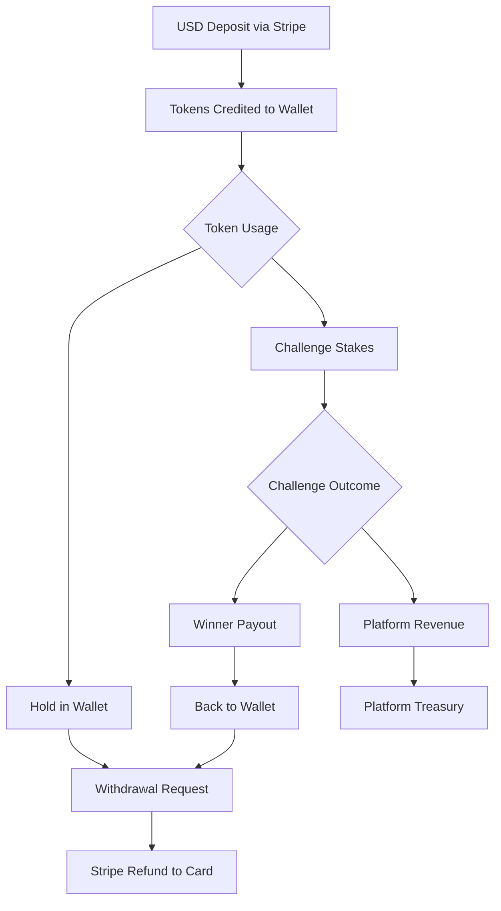

# Token Economy

## Overview

PeerPush operates on a token-based economy where users deposit real money to receive tokens, which are then used to participate in challenges. The system maintains a 1:1 relationship between tokens and USD cents for simplicity and transparency.

## Token Fundamentals

### Pricing Model
- **1 Token = 1 USD Cent**
- Example: $10.00 USD = 1,000 tokens
- Minimum purchase: 1 token ($0.01)
- Maximum daily deposit: 100,000 tokens ($1,000)

### Token Types
All tokens in the system are fungible - there's no distinction between tokens from different sources once they're in a user's wallet.

## Token Lifecycle



## Wallet System (M7 Implementation)

### Core Principles
1. **FIFO Allocation**: First tokens in are first tokens out
2. **Lot Tracking**: Each deposit creates a distinct "lot" with metadata
3. **Refund Accuracy**: Withdrawals refund to original payment methods
4. **ACID Compliance**: All operations are atomic and consistent

### Wallet Tables

#### `wallet_entries`
Primary transaction log for all wallet activity:
```sql
CREATE TABLE wallet_entries (
    id UUID PRIMARY KEY DEFAULT gen_random_uuid(),
    user_id UUID NOT NULL REFERENCES users(id),
    type VARCHAR(20) NOT NULL CHECK (type IN ('DEPOSIT', 'STAKE', 'PAYOUT', 'WITHDRAWAL')),
    amount INTEGER NOT NULL,
    currency VARCHAR(3) DEFAULT 'usd',
    external_id VARCHAR(255),
    note TEXT,
    created_at TIMESTAMP WITH TIME ZONE DEFAULT NOW(),
    CONSTRAINT positive_deposits CHECK (type != 'DEPOSIT' OR amount > 0),
    CONSTRAINT negative_stakes CHECK (type != 'STAKE' OR amount < 0),
    CONSTRAINT positive_payouts CHECK (type != 'PAYOUT' OR amount > 0),
    CONSTRAINT negative_withdrawals CHECK (type != 'WITHDRAWAL' OR amount < 0)
);
```

#### `wallet_allocations`
Tracks individual deposit lots for FIFO processing:
```sql
CREATE TABLE wallet_allocations (
    id UUID PRIMARY KEY DEFAULT gen_random_uuid(),
    user_id UUID NOT NULL REFERENCES users(id),
    original_amount INTEGER NOT NULL CHECK (original_amount > 0),
    remaining_amount INTEGER NOT NULL CHECK (remaining_amount >= 0),
    payment_intent_id VARCHAR(255) NOT NULL,
    deposit_entry_id UUID NOT NULL REFERENCES wallet_entries(id),
    created_at TIMESTAMP WITH TIME ZONE DEFAULT NOW()
);
```

#### `wallet_refunds`
Records refunds against original deposits:
```sql
CREATE TABLE wallet_refunds (
    id UUID PRIMARY KEY DEFAULT gen_random_uuid(),
    user_id UUID NOT NULL REFERENCES users(id),
    allocation_id UUID NOT NULL REFERENCES wallet_allocations(id),
    amount INTEGER NOT NULL CHECK (amount > 0),
    stripe_refund_id VARCHAR(255) NOT NULL,
    withdrawal_entry_id UUID NOT NULL REFERENCES wallet_entries(id),
    created_at TIMESTAMP WITH TIME ZONE DEFAULT NOW()
);
```

## Token Operations

### 1. Deposits
**Process**: Stripe checkout → webhook → token credit

```python
# Example: User deposits $25.00
stripe_amount_cents = 2500
tokens_received = stripe_amount_cents // TOKEN_PRICE_USD_CENTS  # 2500 tokens

# Creates:
# - wallet_entries: +2500 tokens (DEPOSIT)
# - wallet_allocations: 2500 token lot with Stripe payment_intent_id
```

### 2. Stakes
**Process**: Challenge join/creation → automatic stake deduction

```python
# Example: User joins challenge with 50 token stake
stake_amount = 50

# Creates:
# - wallet_entries: -50 tokens (STAKE)
# - Reduces wallet_allocations remaining_amount (FIFO order)
```

### 3. Payouts
**Process**: Challenge completion → automatic winner payout

```python
# Example: Winner receives 150 tokens from challenge pool
payout_amount = 150

# Creates:
# - wallet_entries: +150 tokens (PAYOUT)
# - wallet_allocations: New 150 token lot (synthetic, no payment_intent)
```

### 4. Withdrawals
**Process**: User withdrawal request → FIFO refund → Stripe refund

```python
# Example: User withdraws 100 tokens
withdrawal_amount = 100

# Process:
# 1. Find oldest wallet_allocations with remaining_amount > 0
# 2. Process refunds in FIFO order
# 3. Create Stripe refunds against original payment_intents
# 4. Record wallet_refunds entries
# 5. Create wallet_entries: -100 tokens (WITHDRAWAL)
```

## Business Rules

### Deposit Rules
- **Minimum**: 1 token ($0.01)
- **Maximum Daily**: 100,000 tokens ($1,000) per user
- **Payment Methods**: Credit/debit cards via Stripe
- **Processing**: Real-time via Stripe webhooks
- **Failure Handling**: Failed payments don't create wallet entries

### Stake Rules
- **Insufficient Funds**: Transactions fail if wallet balance < stake
- **Automatic Deduction**: Stakes debited immediately on challenge join/creation
- **Refund Policy**: Stakes only refunded if challenge is cancelled by platform

### Payout Rules
- **Automatic Processing**: Winners paid immediately on challenge completion
- **Distribution Logic**: Based on verification results and challenge rules
- **Source**: Comes from total stake pool of all participants
- **Timing**: Processed by challenge end workflow

### Withdrawal Rules
- **FIFO Processing**: Always refund oldest deposits first
- **Original Method**: Refunds go back to original payment method
- **Processing Time**: 5-10 business days (Stripe standard)
- **Limits**: Can't withdraw more than current wallet balance
- **Window**: 90-day refund window from original deposit

## Advanced Features

### Advisory Locks
All wallet operations use PostgreSQL advisory locks to prevent race conditions:

```python
async def debit_tokens(session: AsyncSession, user_id: UUID, amount: int):
    # Acquire exclusive lock for this user's wallet
    await session.execute(text("SELECT pg_advisory_lock(:lock_id)"), {"lock_id": hash(user_id)})
    
    try:
        # Perform wallet operations atomically
        # ... debit logic ...
    finally:
        # Release lock
        await session.execute(text("SELECT pg_advisory_unlock(:lock_id)"), {"lock_id": hash(user_id)})
```

### Balance Calculation
Wallet balance is calculated in real-time by summing all wallet_entries:

```sql
SELECT COALESCE(SUM(amount), 0) AS balance
FROM wallet_entries 
WHERE user_id = $1;
```

### Allocation Tracking
FIFO withdrawal processing uses wallet_allocations:

```sql
SELECT * FROM wallet_allocations 
WHERE user_id = $1 AND remaining_amount > 0 
ORDER BY created_at ASC;
```

## Error Handling

### Insufficient Funds
- **Detection**: Before any debit operation
- **Response**: HTTP 400 with specific error message
- **Recovery**: User must deposit more tokens

### Payment Failures
- **Stripe Webhooks**: Handle failed payment notifications
- **Idempotency**: Prevent duplicate processing
- **Cleanup**: No wallet entries created for failed payments

### Refund Failures
- **Retry Logic**: Automatic retry for temporary Stripe failures
- **Manual Review**: Flag complex refund scenarios
- **User Communication**: Notify users of refund status

## Monitoring and Analytics

### Key Metrics
- **Total Tokens in Circulation**: Sum of all user wallet balances
- **Daily Deposit Volume**: Tokens purchased per day
- **Daily Withdrawal Volume**: Tokens withdrawn per day
- **Platform Revenue**: Forfeited stakes from failed challenges
- **Average Wallet Balance**: Per user token holdings

### Financial Reconciliation
- **Stripe Balance**: Must equal total wallet_allocations
- **Token Conservation**: Total deposits = total withdrawals + current balances + platform revenue
- **Audit Trail**: Every token movement tracked in ledger_entries

## Future Enhancements

### Planned Features
1. **Token Gifts**: Transfer tokens between users
2. **Bulk Operations**: Batch deposits/withdrawals
3. **Premium Subscriptions**: Monthly token allowances
4. **Interest System**: Earn tokens for holding balance
5. **Loyalty Rewards**: Bonus tokens for active users

### Scalability Improvements
1. **Async Processing**: Background job queues for heavy operations
2. **Caching Layer**: Redis cache for frequently accessed balances
3. **Partitioning**: Partition large tables by user_id or date
4. **Event Sourcing**: Immutable event log for all token operations