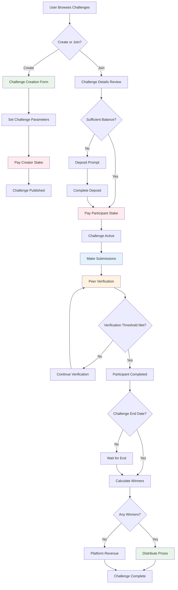
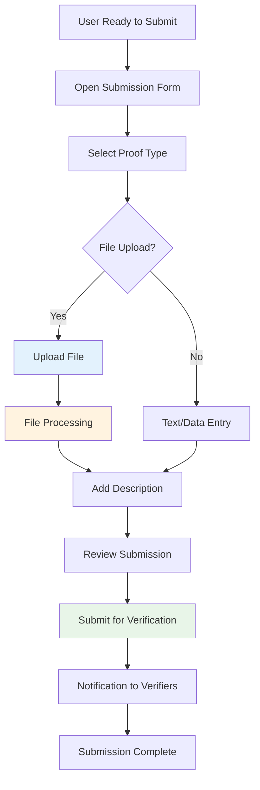

# Challenge Participation Workflow

## Overview

The challenge participation workflow encompasses the complete lifecycle from challenge discovery to payout, including creation, joining, submission, verification, and reward distribution.

## Complete Challenge Lifecycle



## Phase 1: Challenge Discovery & Selection

### Challenge Browse Experience

**Discovery Methods**:
1. **Featured Challenges**: Curated high-quality challenges
2. **Category Browse**: Fitness, Learning, Creative, Professional
3. **Search & Filter**: By stake amount, duration, difficulty
4. **Recommendations**: Based on user history and preferences
5. **Social Feed**: Challenges from followed users

**Challenge Card Information**:
```json
{
  "id": "challenge-uuid",
  "title": "30-Day Push-up Challenge",
  "creator": {
    "username": "fitness_coach_mike",
    "reputation_score": 4.8,
    "challenges_created": 25
  },
  "overview": {
    "description": "Build upper body strength with daily push-ups",
    "stake_amount": 50,
    "duration_days": 30,
    "max_participants": 20,
    "current_participants": 12,
    "success_rate": 75,
    "difficulty": "intermediate"
  },
  "requirements": {
    "daily_commitment": "10-15 minutes",
    "equipment_needed": "None",
    "experience_level": "Beginner friendly"
  },
  "community": {
    "participant_countries": ["US", "CA", "UK", "AU"],
    "age_range": "22-45",
    "active_discussions": 8
  }
}
```

**Advanced Filtering Options**:
- **Stake Range**: $5-10, $10-25, $25-50, $50-100, $100+
- **Duration**: 1 week, 2 weeks, 1 month, 2+ months
- **Category**: 15+ categories with subcategories
- **Difficulty**: Beginner, Intermediate, Advanced, Expert
- **Start Date**: Starting soon, this week, this month
- **Success Rate**: High (>80%), Medium (60-80%), Low (<60%)
- **Creator Rating**: 4+ stars, verified creators only
- **Language**: Multiple language support

### Challenge Detail View

**Comprehensive Challenge Information**:

#### Challenge Overview Section
- Full description with formatting support
- Video introduction from creator (optional)
- Challenge rules and requirements
- Success criteria and verification process
- Timeline and key milestones

#### Financial Information
- Stake amount and reasoning
- Prize pool calculation
- Historical payout data for similar challenges
- Platform fee structure (transparent)

#### Community & Social Proof
- Current participant list (with privacy settings)
- Success stories from previous participants
- Q&A section with creator responses
- Community discussion forum
- Related challenges and recommendations

#### Creator Profile
- Creator background and credentials
- Previous challenge success rates
- Community ratings and reviews
- Verification badges and achievements
- Social media links (if provided)

## Phase 2: Challenge Creation

### Creation Wizard Flow

**Step 1: Basic Information**
```json
{
  "title": "30-Day Push-up Challenge",
  "category": "fitness",
  "subcategory": "strength_training",
  "short_description": "Build upper body strength with daily push-ups",
  "detailed_description": "A comprehensive 30-day program...",
  "difficulty_level": "intermediate",
  "estimated_time_commitment": "15 minutes daily"
}
```

**Step 2: Challenge Parameters**
```json
{
  "duration": {
    "type": "fixed_duration",
    "days": 30,
    "start_date": "2025-10-01T00:00:00Z",
    "end_date": "2025-10-31T23:59:59Z"
  },
  "participation": {
    "max_participants": 20,
    "min_participants": 5,
    "late_join_allowed": false,
    "auto_start": true
  },
  "verification": {
    "threshold": 2,
    "self_verification_allowed": false,
    "creator_verification_weight": 1.5,
    "verification_deadline_hours": 48
  }
}
```

**Step 3: Rules & Requirements**
- Detailed challenge rules with examples
- Daily/weekly requirements specification
- Submission guidelines and formats
- Equipment or prerequisites needed
- Acceptable proof types (photo, video, text, data)

**Step 4: Financial Setup**
```json
{
  "stake_amount": 50,
  "stake_justification": "Motivational amount for 30-day commitment",
  "creator_stake": 50,
  "payout_structure": "equal_split",
  "early_exit_policy": "no_refund",
  "bonus_pool": 0
}
```

**Step 5: Review & Publish**
- Preview challenge as participants will see it
- Terms and conditions acknowledgment
- Content guidelines compliance check
- Automatic creator stake deduction
- Challenge publication and notification to followers

### Challenge Creation Validation

**Automated Checks**:
- Appropriate content (no gambling, illegal activities)
- Realistic timeline and requirements
- Clear success criteria definition
- Proper stake amount (not too high for difficulty)
- Grammar and clarity review suggestions

**Creator Guidelines Enforcement**:
- Maximum 5 active challenges per creator
- Minimum 24-hour advance notice for start date
- Required response time to participant questions
- Creator must participate in own challenge
- Historical performance requirements for high-stake challenges

## Phase 3: Joining Challenges

### Pre-Join Validation

**Eligibility Checks**:
1. **Account Status**: Active and verified
2. **Wallet Balance**: Sufficient for stake
3. **Challenge Capacity**: Not at max participants
4. **Timing**: Challenge not started or allows late join
5. **Previous Participation**: Not already joined
6. **Creator Restrictions**: Cannot join own challenges

**Financial Validation**:
```python
def validate_challenge_join(user_id: str, challenge_id: str) -> dict:
    user_balance = get_wallet_balance(user_id)
    challenge = get_challenge(challenge_id)
    
    validation_result = {
        "eligible": True,
        "issues": [],
        "warnings": []
    }
    
    if user_balance < challenge.stake_amount:
        validation_result["eligible"] = False
        validation_result["issues"].append({
            "type": "insufficient_balance",
            "message": f"Need {challenge.stake_amount} tokens, have {user_balance}",
            "action": "deposit_required",
            "deposit_amount": challenge.stake_amount - user_balance
        })
    
    return validation_result
```

### Join Confirmation Process

**Join Challenge Modal**:
- Challenge summary and key details
- Stake amount and commitment confirmation
- Rules acknowledgment checkbox
- Expected time commitment reminder
- Cancel policy explanation
- Final balance after stake deduction

**Stake Payment Transaction**:
1. **Advisory Lock**: Prevent concurrent wallet modifications
2. **Balance Check**: Verify sufficient funds
3. **Stake Deduction**: Atomic wallet balance update
4. **Participation Record**: Create participant entry
5. **Challenge Update**: Increment participant count
6. **Confirmation**: Send join confirmation email
7. **Unlock**: Release advisory lock

### Post-Join Experience

**Immediate Actions**:
- Welcome email with challenge details
- Calendar integration options (Google, Outlook)
- Mobile app notification setup
- Introduction to other participants (optional)
- First submission guidance

**Challenge Dashboard Access**:
- Personal progress tracking
- Submission history and status
- Verification activities (for peer verification)
- Challenge leaderboard and statistics
- Communication tools with other participants

## Phase 4: Challenge Execution & Submissions

### Submission Workflow

**Daily Submission Process**:


**Submission Types & Requirements**:

#### Photo Submissions
- **Accepted Formats**: JPEG, PNG, WebP, HEIC
- **Size Limits**: 10MB maximum
- **Quality Requirements**: Minimum resolution guidelines
- **Content Guidelines**: Clear visibility of activity
- **Metadata**: Timestamp, location (optional), device info

#### Video Submissions
- **Accepted Formats**: MP4, MOV, WebM
- **Size Limits**: 50MB maximum
- **Duration**: 15 seconds to 5 minutes
- **Quality**: Minimum 480p resolution
- **Content**: Must show complete activity or key moments

#### Data/Metrics Submissions
- **Fitness Data**: Steps, heart rate, distance, calories
- **Learning Data**: Pages read, study time, practice sessions
- **Custom Metrics**: Challenge-specific measurements
- **Integration**: Fitness apps, learning platforms, IoT devices
- **Verification**: Screenshot or API integration proof

### Automated Submission Processing

**Upload Pipeline**:
1. **File Upload**: Secure upload to cloud storage
2. **Virus Scanning**: Automated malware detection
3. **Content Analysis**: Basic appropriateness check
4. **Metadata Extraction**: EXIF data, duration, size
5. **Thumbnail Generation**: Preview images for videos
6. **Database Storage**: File references and metadata
7. **Notification**: Alert potential verifiers

**Quality Checks**:
```python
async def process_submission(submission_data: dict) -> dict:
    checks = {
        "file_integrity": await verify_file_integrity(submission_data["file"]),
        "content_appropriate": await content_moderation_check(submission_data["file"]),
        "meets_requirements": await challenge_requirements_check(
            submission_data["challenge_id"], 
            submission_data["file"]
        ),
        "timestamp_valid": validate_submission_timing(submission_data["created_at"]),
        "user_eligible": await check_user_participation_status(submission_data["user_id"])
    }
    
    return {
        "status": "approved" if all(checks.values()) else "needs_review",
        "checks": checks,
        "next_steps": get_next_steps(checks)
    }
```

## Phase 5: Peer Verification System

### Verification Algorithm

**Verifier Selection**:
- Random selection from active participants
- Exclude submission creator
- Prioritize users with good verification history
- Ensure minimum geographic/demographic diversity
- Limit verification load per user

**Verification Interface**:
```json
{
  "submission": {
    "id": "submission-uuid",
    "participant": "alice_fitness",
    "challenge_day": 15,
    "proof_type": "video",
    "file_url": "https://secure-presigned-url",
    "description": "Day 15 - 100 push-ups completed",
    "submitted_at": "2025-10-15T18:30:00Z"
  },
  "challenge_context": {
    "title": "30-Day Push-up Challenge",
    "day_requirement": "Complete 100 push-ups with proper form",
    "success_criteria": "Full range of motion, controlled movement"
  },
  "verification_options": {
    "approve": "Submission meets requirements",
    "reject": "Submission does not meet requirements",
    "unclear": "Need more information or better proof"
  }
}
```

**Verification Decision Process**:
1. **Evidence Review**: Examine photo/video proof
2. **Requirement Check**: Compare against challenge criteria
3. **Quality Assessment**: Verify proof clarity and completeness
4. **Fairness Consideration**: Apply consistent standards
5. **Feedback Provision**: Helpful comments for improvement
6. **Decision Recording**: Submit approval/rejection with reasoning

### Consensus Mechanism

**Threshold System**:
- **Default Threshold**: 2 approvals required
- **Dynamic Adjustment**: Based on challenge difficulty and stakes
- **Weighted Voting**: Experienced verifiers have higher weight
- **Tie Breaking**: Creator or admin can cast deciding vote
- **Appeal Process**: Disputed decisions can be escalated

**Verification Status Calculation**:
```python
def calculate_verification_status(submission_id: str) -> str:
    verifications = get_verifications(submission_id)
    challenge = get_challenge_for_submission(submission_id)
    
    approvals = sum(1 for v in verifications if v.verdict == "approve")
    rejections = sum(1 for v in verifications if v.verdict == "reject")
    threshold = challenge.verification_threshold
    
    if approvals >= threshold:
        return "verified"
    elif rejections >= threshold:
        return "rejected"
    elif len(verifications) >= challenge.max_verifications:
        return "approved" if approvals > rejections else "rejected"
    else:
        return "pending"
```

### Verification Quality Control

**Verifier Incentives**:
- **Reputation System**: Build credibility through consistent, fair verification
- **Verification Rewards**: Small token rewards for active verifiers
- **Badges & Recognition**: Public recognition for quality verifiers
- **Priority Access**: Early access to new features and challenges
- **Community Status**: Verified verifier badges and permissions

**Quality Metrics**:
- **Consistency Score**: Agreement with other verifiers
- **Response Time**: Speed of verification completion
- **Feedback Quality**: Helpfulness of verification comments
- **Participation Rate**: Regular verification activity
- **Dispute Resolution**: How often verifications are appealed

## Phase 6: Challenge Completion & Payouts

### Completion Determination

**Individual Completion Criteria**:
```python
def check_participant_completion(participant_id: str, challenge_id: str) -> dict:
    challenge = get_challenge(challenge_id)
    submissions = get_participant_submissions(participant_id, challenge_id)
    
    # Calculate completion percentage
    required_submissions = challenge.duration_days
    verified_submissions = sum(1 for s in submissions if s.status == "verified")
    completion_rate = verified_submissions / required_submissions
    
    # Determine success based on challenge rules
    success_threshold = challenge.completion_threshold or 0.8  # 80% default
    is_completed = completion_rate >= success_threshold
    
    return {
        "participant_id": participant_id,
        "completion_rate": completion_rate,
        "verified_submissions": verified_submissions,
        "required_submissions": required_submissions,
        "is_completed": is_completed,
        "completion_details": get_completion_breakdown(submissions)
    }
```

**Challenge End Processing**:
1. **Final Verification**: Complete any pending verifications
2. **Participant Assessment**: Determine individual completion status
3. **Winner Calculation**: Identify successful participants
4. **Prize Pool Distribution**: Calculate individual payouts
5. **Transaction Processing**: Execute wallet transfers
6. **Notification Delivery**: Inform all participants of results
7. **Challenge Archival**: Move to completed status

### Payout Distribution Algorithm

**Equal Split Distribution** (Most Common):
```python
def calculate_equal_split_payouts(challenge_id: str) -> dict:
    challenge = get_challenge(challenge_id)
    winners = get_successful_participants(challenge_id)
    total_stake_pool = challenge.total_participants * challenge.stake_amount
    
    if len(winners) == 0:
        # No winners - platform captures all stakes
        return {
            "payout_type": "platform_revenue",
            "total_pool": total_stake_pool,
            "platform_revenue": total_stake_pool,
            "participant_payouts": {}
        }
    
    # Equal distribution among winners
    payout_per_winner = total_stake_pool // len(winners)
    remainder = total_stake_pool % len(winners)
    
    payouts = {}
    for i, winner in enumerate(winners):
        # Distribute remainder to first few winners
        extra = 1 if i < remainder else 0
        payouts[winner.user_id] = payout_per_winner + extra
    
    return {
        "payout_type": "equal_split",
        "total_pool": total_stake_pool,
        "winner_count": len(winners),
        "platform_revenue": 0,
        "participant_payouts": payouts
    }
```

**Performance-Based Distribution** (Advanced):
```python
def calculate_performance_payouts(challenge_id: str) -> dict:
    winners = get_successful_participants(challenge_id)
    challenge = get_challenge(challenge_id)
    total_pool = challenge.total_participants * challenge.stake_amount
    
    # Calculate performance scores (completion rate, verification quality, etc.)
    scored_winners = []
    for winner in winners:
        score = calculate_performance_score(winner, challenge_id)
        scored_winners.append((winner, score))
    
    # Weighted distribution based on performance
    total_score = sum(score for _, score in scored_winners)
    payouts = {}
    
    for winner, score in scored_winners:
        payout_percentage = score / total_score
        payout_amount = int(total_pool * payout_percentage)
        payouts[winner.user_id] = payout_amount
    
    return {
        "payout_type": "performance_based",
        "total_pool": total_pool,
        "scoring_method": "completion_quality_weighted",
        "participant_payouts": payouts
    }
```

### Automatic Payout Processing

**Transaction Pipeline**:
1. **Payout Calculation**: Determine winner rewards
2. **Advisory Locks**: Lock all winner wallets for updates
3. **Balance Updates**: Credit winner wallets atomically
4. **Ledger Entries**: Create detailed transaction records
5. **Notification System**: Send payout notifications
6. **Challenge Status**: Update challenge to "paid_out"
7. **Audit Trail**: Log all payout activities

**Payout Transaction Record**:
```json
{
  "transaction_id": "tx-payout-uuid",
  "transaction_type": "CHALLENGE_PAYOUT",
  "user_id": "winner-user-uuid",
  "amount": 167,
  "challenge_id": "challenge-uuid",
  "payout_details": {
    "total_pool": 500,
    "winner_count": 3,
    "winner_rank": 1,
    "completion_rate": 0.93,
    "verification_score": 4.8
  },
  "metadata": {
    "payout_batch_id": "batch-2025-10-31",
    "challenge_title": "30-Day Push-up Challenge",
    "challenge_duration": 30
  },
  "created_at": "2025-10-31T23:59:59Z",
  "processed_at": "2025-10-31T23:59:59Z"
}
```

## Phase 7: Post-Challenge Experience

### Winner Experience

**Immediate Post-Payout**:
- Celebration notification with confetti animation
- Detailed payout breakdown and reasoning
- Social sharing options for achievement
- Challenge completion certificate (digital)
- Invitation to similar future challenges
- Opportunity to create own challenge

**Achievement System**:
```json
{
  "achievements_earned": [
    {
      "id": "first_challenge_winner",
      "name": "First Victory",
      "description": "Won your first challenge",
      "badge_url": "https://badges.peerpush.com/first-victory.png",
      "points": 100
    },
    {
      "id": "perfect_completion",
      "name": "Perfect Score",
      "description": "100% completion rate with excellent verification scores",
      "badge_url": "https://badges.peerpush.com/perfect-score.png",
      "points": 250
    }
  ],
  "reputation_boost": 15,
  "new_reputation_score": 4.7
}
```

### Non-Winner Experience

**Supportive Messaging**:
- Encouragement for effort and participation
- Highlight of personal achievements and progress
- Statistics showing improvement over challenge duration
- Recommendations for similar challenges with better fit
- Community support and motivational messages
- Option to join "second chance" challenges at reduced stakes

**Learning & Growth**:
- Detailed analysis of submission patterns
- Verification feedback compilation
- Suggestions for improvement in future challenges
- Connection with successful participants for mentoring
- Access to creator's tips and additional resources

### Challenge Analytics & Insights

**Participant Analytics**:
```json
{
  "challenge_performance": {
    "completion_rate": 0.87,
    "average_verification_score": 4.2,
    "submission_consistency": 0.93,
    "peer_verification_activity": 23,
    "community_engagement_score": 4.1
  },
  "personal_growth": {
    "improvement_trend": "positive",
    "strongest_days": [5, 12, 18, 24, 29],
    "challenge_areas": ["weekend_consistency", "proof_quality"],
    "verification_accuracy": 0.89
  },
  "recommendations": {
    "next_challenge_types": ["strength_building", "habit_formation"],
    "suggested_stake_range": "25-75",
    "recommended_duration": "14-21 days",
    "skill_development_areas": ["video_proof_techniques", "progress_tracking"]
  }
}
```

**Platform Analytics Collection**:
- Challenge success rates by category and stakes
- User engagement patterns and retention
- Verification quality and speed metrics
- Popular challenge types and seasonal trends
- Geographic and demographic participation data
- Revenue generation and growth patterns

## Error Handling & Edge Cases

### Common Challenge Issues

#### Challenge Creator Abandonment
**Scenario**: Creator stops participating or responding
**Solutions**:
- Automatic creator replacement system
- Co-creator assignment for high-stakes challenges
- Community moderation takeover
- Proportional refund to participants
- Platform intervention and resolution

#### Technical Failures During Critical Moments
**End-of-Challenge Processing Failures**:
```python
async def handle_payout_failure(challenge_id: str, error: Exception) -> dict:
    # Log detailed error information
    await log_payout_error(challenge_id, error)
    
    # Lock challenge to prevent duplicate processing
    await lock_challenge_processing(challenge_id)
    
    # Notify technical team
    await alert_technical_team(f"Payout failure for challenge {challenge_id}")
    
    # Queue for manual resolution
    await queue_for_manual_payout(challenge_id)
    
    # Notify participants of delay
    await notify_participants_of_delay(challenge_id, estimated_resolution_hours=2)
    
    return {
        "status": "error_handled",
        "resolution_method": "manual_processing_queued",
        "participant_notification_sent": True
    }
```

#### Dispute Resolution Process
**Verification Disputes**:
1. **Initial Appeal**: Participant requests review
2. **Evidence Collection**: Gather additional proof and context
3. **Expert Review**: Platform moderator or expert verifier assessment
4. **Community Input**: Optional community voting on clear cases
5. **Final Decision**: Binding resolution with detailed reasoning
6. **Process Improvement**: Update guidelines based on learnings

### Advanced Challenge Features

#### Team-Based Challenges
**Multi-Participant Collaboration**:
- Team formation and role assignment
- Collective goals and individual contributions
- Team communication and coordination tools
- Shared progress tracking and accountability
- Team-based verification and support

#### Seasonal & Event Challenges
**Special Challenge Types**:
- Holiday-themed challenges with bonus rewards
- Charity fundraising challenges with donation matching
- Corporate wellness programs with employer sponsorship
- Educational challenges tied to courses or certifications
- Community challenges for local events and causes

#### Progressive Challenge Systems
**Long-Term Engagement**:
- Multi-stage challenges with increasing difficulty
- Prerequisite challenges for advanced programs
- Achievement-locked challenges for experienced users
- Seasonal progression tracks (annual fitness journeys)
- Master programs spanning multiple months

## Performance Optimization

### Database Query Optimization
```sql
-- Optimized challenge listing query
SELECT c.*, 
       COUNT(p.id) as current_participants,
       AVG(cr.rating) as creator_rating,
       (SELECT COUNT(*) FROM submissions s 
        JOIN participants p2 ON s.participant_id = p2.id 
        WHERE p2.challenge_id = c.id AND s.status = 'verified') as total_verified_submissions
FROM challenges c
LEFT JOIN participants p ON c.id = p.challenge_id
LEFT JOIN users u ON c.creator_id = u.id
LEFT JOIN creator_ratings cr ON u.id = cr.creator_id
WHERE c.status = 'active' 
  AND c.start_date <= NOW() 
  AND c.end_date >= NOW()
  AND (c.max_participants IS NULL OR COUNT(p.id) < c.max_participants)
GROUP BY c.id
ORDER BY c.featured DESC, c.created_at DESC
LIMIT 20 OFFSET 0;
```

### Caching Strategy
- **Challenge Lists**: 5-minute cache for active challenges
- **Challenge Details**: 1-minute cache for individual challenges
- **User Progress**: Real-time updates with cache invalidation
- **Verification Queues**: 30-second cache for verifier assignment
- **Leaderboards**: 10-minute cache with periodic updates

### Real-Time Features
- **Live Progress Updates**: WebSocket connections for real-time progress
- **Verification Notifications**: Instant alerts for verification needs
- **Challenge Chat**: Real-time communication between participants
- **Live Leaderboards**: Dynamic ranking updates during challenges
- **Push Notifications**: Mobile alerts for key events and deadlines

---

*This comprehensive workflow ensures smooth, engaging, and fair challenge participation while maintaining platform integrity and user satisfaction throughout the entire challenge lifecycle.*