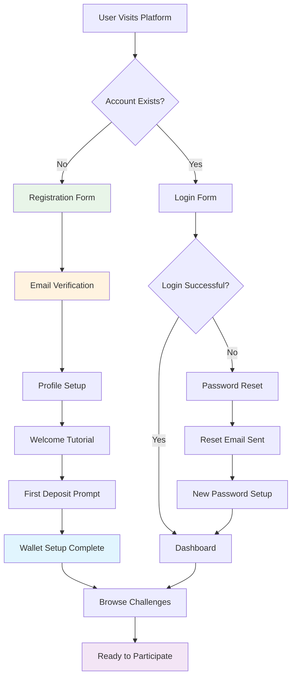
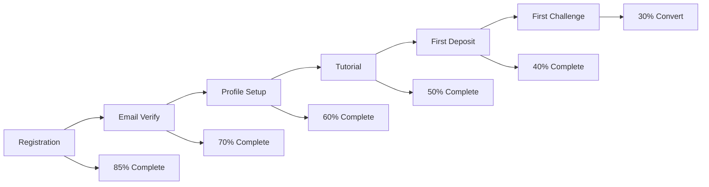

# User Onboarding Workflow

## Overview

The user onboarding process is designed to get new users registered, verified, and ready to participate in challenges with minimal friction while ensuring security and compliance.

## Complete Onboarding Flow



## Step-by-Step Process

### 1. Registration
**Endpoint**: `POST /auth/register`

**User Experience**:
- Simple form: email, password, confirm password
- Real-time validation for email format and password strength
- Clear password requirements displayed
- Terms of service and privacy policy acceptance

**Technical Process**:
1. Validate email format and uniqueness
2. Hash password with bcrypt
3. Create user record with `pending_verification` status
4. Generate verification token
5. Send welcome email with verification link
6. Return success message (no sensitive data)

**Email Template** (Welcome + Verification):
```
Subject: Welcome to PeerPush! Verify your account

Hi there!

Welcome to PeerPush - where challenges meet community verification!

Please verify your email address by clicking the link below:
[Verify My Account - Expires in 24 hours]

Once verified, you'll be able to:
✅ Deposit tokens and join challenges
✅ Create your own challenges
✅ Verify other participants' progress
✅ Earn rewards for completing challenges

Need help? Reply to this email or visit our help center.

Welcome to the community!
The PeerPush Team
```

### 2. Email Verification
**Endpoint**: `POST /auth/verify-email`

**User Experience**:
- User clicks verification link from email
- Automatic redirect to platform with success message
- If link expired, easy re-send verification option
- Clear next steps displayed

**Technical Process**:
1. Validate verification token and expiration
2. Update user status to `active`
3. Create empty wallet record
4. Log successful verification event
5. Generate access and refresh tokens
6. Redirect to onboarding flow

**Verification Success Page**:
- Congratulations message
- Account status confirmation
- Next steps: Profile setup
- Quick tutorial overview

### 3. Profile Setup (Optional but Recommended)
**Endpoint**: `PUT /users/profile`

**User Experience**:
- Optional profile information form
- Username selection (for leaderboards)
- Profile picture upload
- Privacy settings configuration
- Skip option for users who want to start immediately

**Profile Fields**:
- **Username**: Unique identifier for public display
- **Display Name**: Friendly name for challenges
- **Bio**: Short description (optional)
- **Profile Picture**: Avatar image (optional)
- **Privacy Settings**: Profile visibility, leaderboard participation

**Technical Implementation**:
```json
{
  "username": "fitness_alice",
  "display_name": "Alice Johnson",
  "bio": "Fitness enthusiast, love community challenges!",
  "profile_picture_url": "https://storage.peerpush.com/profiles/user-uuid.jpg",
  "privacy_settings": {
    "profile_visible": true,
    "show_in_leaderboards": true,
    "allow_direct_messages": false
  }
}
```

### 4. Welcome Tutorial
**Interactive Onboarding Experience**:

#### Tutorial Steps:
1. **Platform Overview** (30 seconds)
   - What is PeerPush?
   - How challenges work
   - Community verification concept

2. **Token System** (45 seconds)
   - How tokens work (1 token = 1 cent)
   - Deposit process overview
   - Stake and reward system

3. **Challenge Participation** (60 seconds)
   - How to join challenges
   - Submission requirements
   - Verification process

4. **Creating Challenges** (45 seconds)
   - Challenge creation basics
   - Setting stakes and rules
   - Managing participants

**Implementation**:
- Interactive walkthrough with highlights
- Progress indicator (4 steps)
- Skip option for experienced users
- Tutorial completion tracking in user profile

### 5. First Deposit Prompt
**Strategic Onboarding Conversion**:

**User Experience**:
- Compelling value proposition
- Multiple deposit amount options
- Bonus tokens for first deposit (promotional)
- Clear explanation of how tokens work
- No pressure - can skip and deposit later

**Deposit Options**:
- **Starter Pack**: $10 (1,000 tokens) + 100 bonus tokens
- **Challenge Ready**: $25 (2,500 tokens) + 300 bonus tokens  
- **Power User**: $50 (5,000 tokens) + 750 bonus tokens
- **Custom Amount**: User-defined amount

**Promotional Strategy**:
```json
{
  "first_deposit_bonus": {
    "enabled": true,
    "bonus_percentage": 10,
    "maximum_bonus": 1000,
    "expires_days": 7,
    "terms": "Bonus tokens valid for 30 days, must be used in challenges"
  }
}
```

### 6. Wallet Setup Completion
**Automatic Wallet Initialization**:

**Technical Process**:
1. Create wallet record linked to user
2. Initialize balance at 0 tokens
3. Set up transaction tracking
4. Configure default settings
5. Create welcome bonus transaction (if applicable)

**Wallet Features Explained**:
- Real-time balance tracking
- Transaction history
- Automatic stake management
- Withdrawal capabilities
- Security features (2FA for large transactions)

## Onboarding Analytics & Optimization

### Key Onboarding Metrics
- **Registration Completion Rate**: % who complete registration
- **Email Verification Rate**: % who verify within 24 hours
- **Profile Completion Rate**: % who add profile information
- **Tutorial Completion Rate**: % who finish welcome tutorial
- **First Deposit Rate**: % who make initial deposit
- **Time to First Challenge**: Days from registration to first participation
- **30-Day Retention**: % still active after 30 days

### A/B Testing Opportunities
1. **Registration Form Length**: Minimal vs detailed initial form
2. **Email Verification**: Immediate vs progressive verification
3. **Tutorial Format**: Interactive vs video vs text-based
4. **Deposit Incentives**: Bonus amounts and promotional copy
5. **Onboarding Flow Order**: Different step sequences

### Conversion Optimization


## Error Handling & Edge Cases

### Common Registration Issues

#### Email Already Registered
**Scenario**: User tries to register with existing email
**Response**: 
- Friendly error message
- Option to login instead
- Password reset link if needed
- No confirmation of email existence (security)

```json
{
  "error": "email_already_registered",
  "message": "An account with this email already exists. Try logging in instead.",
  "actions": [
    {"type": "login", "text": "Go to Login"},
    {"type": "reset_password", "text": "Forgot Password?"}
  ]
}
```

#### Password Too Weak
**Requirements**:
- Minimum 8 characters
- At least one uppercase letter
- At least one lowercase letter
- At least one number
- Special characters recommended but not required

**User Experience**:
- Real-time password strength indicator
- Clear requirements list
- Helpful suggestions for improvement
- No frustrating password complexity

#### Email Verification Issues
**Expired Token**:
- Clear error message explaining expiration
- One-click re-send verification
- Extended 48-hour window for re-sent emails
- Support contact for persistent issues

**Invalid Token**:
- Redirect to re-send verification page
- Check if already verified
- Clear troubleshooting steps

### Technical Error Handling
```python
# Registration error handling example
try:
    user = await create_user(email, hashed_password)
    await send_verification_email(user.email, verification_token)
    return {"message": "Registration successful, please check your email"}
except EmailAlreadyExistsError:
    raise HTTPException(status_code=409, detail="Email already registered")
except EmailDeliveryError:
    # Still create account but flag for manual verification
    await flag_for_manual_verification(user.id)
    return {"message": "Account created, please contact support for verification"}
```

## Post-Onboarding Engagement

### First 7 Days Strategy
**Day 1**: Welcome email with getting started tips
**Day 2**: Tutorial completion reminder (if skipped)
**Day 3**: First challenge recommendations based on profile
**Day 5**: Community highlights and success stories
**Day 7**: Personal progress summary and encouragement

### First Challenge Recommendations
**Algorithm Factors**:
- Lower stakes for beginners ($5-15 range)
- Popular challenges with high success rates
- Shorter duration challenges (7-14 days)
- Clear, achievable goals
- Active community participation

**Example Beginner Challenges**:
- "7-Day Water Challenge" - Drink 8 glasses daily
- "Daily Steps Challenge" - 8,000 steps for 10 days
- "Mindful Minutes" - 10 minutes meditation for 14 days
- "Reading Habit" - Read 20 pages daily for 2 weeks

### Support During Onboarding
**Help Resources**:
- In-app help tooltips
- FAQ section for common questions
- Live chat support during business hours
- Video tutorials for complex processes
- Community forum for peer support

**Proactive Support Triggers**:
- Stuck on verification for >24 hours
- Profile incomplete after 3 days
- No challenge participation after 7 days
- Multiple failed login attempts
- Support ticket creation

## Mobile App Onboarding Considerations

### Platform-Specific Features
**iOS/Android Enhancements**:
- Biometric authentication setup
- Push notification permissions
- Camera permissions for submissions
- Photo library access for profile pictures
- Deep linking for email verification

### Progressive Web App (PWA)
**Installation Prompts**:
- Install app banner after 2-3 visits
- Offline functionality explanation
- Native app-like experience promotion
- Home screen shortcut benefits

### Cross-Platform Sync
**Account Continuity**:
- Seamless login across devices
- Sync profile and preferences
- Consistent challenge participation
- Unified notification settings
- Cross-device tutorial progress

## Compliance & Legal Considerations

### GDPR Compliance
**Data Collection Transparency**:
- Clear privacy policy during registration
- Explicit consent for data processing
- Right to deletion explanation
- Data portability options
- Cookie consent management

### Age Verification
**Minor Protection**:
- Age verification during registration
- Parental consent for users under 16
- Restricted challenge participation for minors
- Enhanced privacy protections
- No public profile for minors

### Terms of Service
**Key Points Highlighted**:
- Challenge participation rules
- Token usage and refund policies
- Community guidelines
- Dispute resolution process
- Platform liability limitations

## Success Metrics & KPIs

### Primary Success Indicators
- **Onboarding Completion Rate**: 65% target
- **Time to First Challenge**: <3 days average
- **First Deposit Conversion**: 40% within 7 days
- **30-Day User Retention**: 55% target
- **User Satisfaction Score**: >4.2/5 rating

### Secondary Metrics
- Email verification time (target: <2 hours)
- Tutorial engagement rate (target: 70% completion)
- Profile completion rate (target: 60%)
- Support ticket volume during onboarding
- Error rate in registration process (<1%)

### Long-Term Success Indicators
- **User Lifetime Value**: $245 average
- **Challenge Success Rate**: 70% for onboarded users
- **Community Engagement**: Active verification participation
- **Referral Rate**: 25% of users refer friends
- **Revenue per User**: Growing 15% quarterly

---

*This workflow ensures a smooth, engaging, and secure onboarding experience that converts visitors into active, engaged community members while maintaining security and compliance standards.*